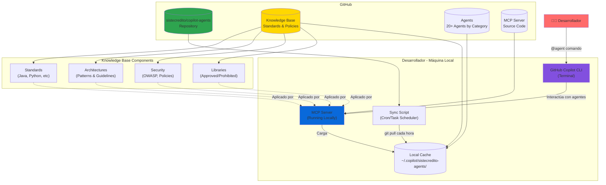
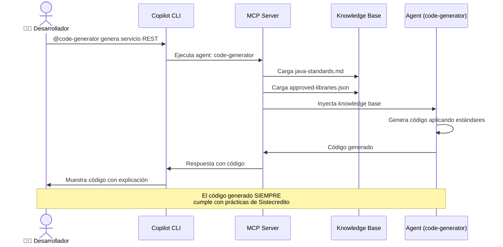
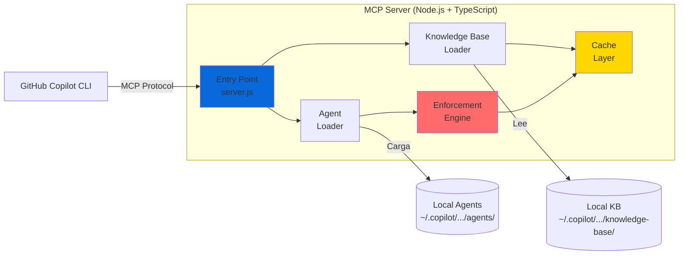
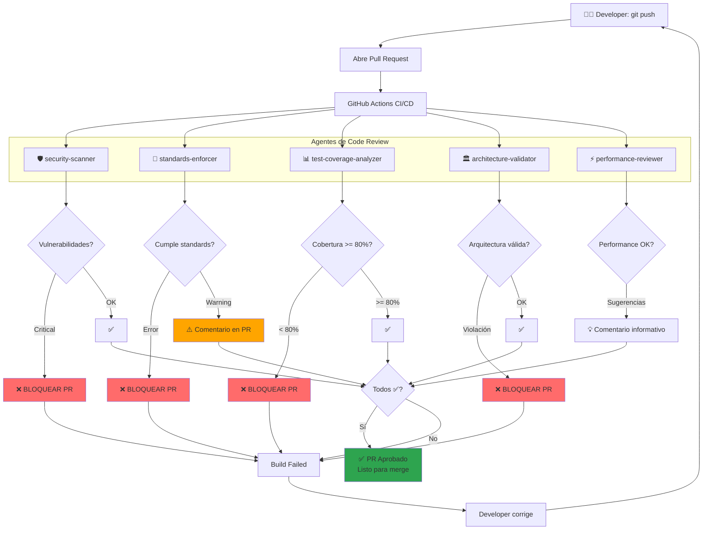
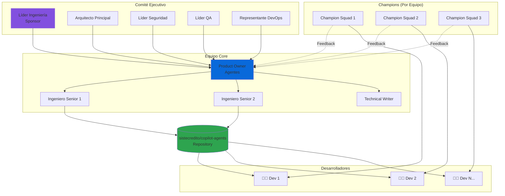
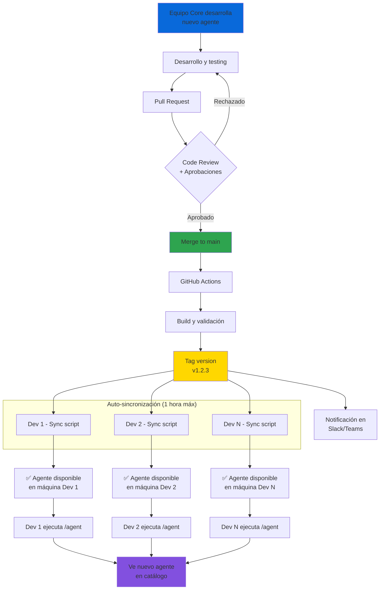
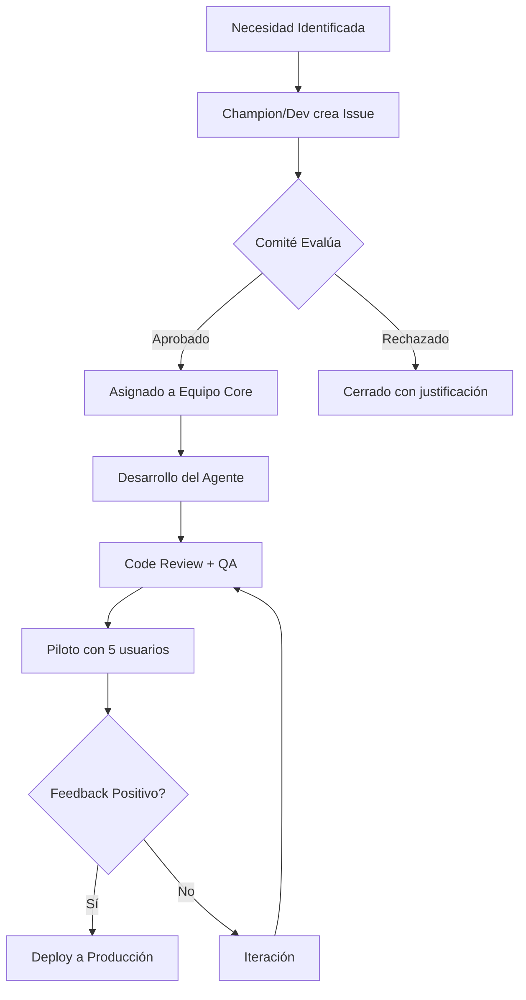

# Plan: Sistema de Agentes SDLC Empresarial para Sistecredito

## Contexto Empresarial
**Organización**: Sistecredito  
**Área responsable**: Ingeniería  
**Alcance**: Todos los desarrolladores de la compañía  
**Objetivo**: Automatizar completamente el SDLC usando agentes personalizados de GitHub Copilot CLI

## Stack Tecnológico de Sistecredito
- **Frontend Web**: Angular
- **Frontend Mobile**: iOS (Swift/Objective-C) y Android (Kotlin/Java) nativos
- **Backend**: .NET (C#)
- **Orquestación y Despliegue**: AKS (Azure Kubernetes Service)
- **Comunicación Sincrónica**: gRPC
- **Comunicación Asincrónica**: Azure Service Bus
- **Exposición Externa**: BFF en NestJS + Azure API Management
- **Nube Principal**: Azure (GCP y AWS permitidos bajo aprobación)
- **Base de Datos**: SQL Server, MongoDB (según caso de uso)
- **Repositorios**: Git + Azure DevOps / GitHub

## Problema
Sistecredito necesita un sistema centralizado para:
- Desarrollar agentes personalizados que automaticen cada fase del SDLC
- Distribuir e instalar agentes en todas las máquinas de desarrolladores
- Sincronizar actualizaciones automáticamente desde un repositorio central
- Mantener gobernanza y control de versiones de los agentes
- Asegurar consistencia en prácticas de desarrollo

**VENTAJA CRÍTICA**: Sistecredito YA TIENE documentación de prácticas tecnológicas en **SisteDocs** (https://docs.sistecreditocloud.com/), lo que acelera significativamente la implementación del knowledge base.

## Diagramas de Arquitectura

### Arquitectura General del Sistema



### Flujo de Trabajo del Desarrollador



### Arquitectura del MCP Server



### Flujo de Sincronización Automática


### Proceso de Code Review con Agentes



### Estructura de Governance



### Deployment de Agentes a Todos los Desarrolladores



---

## Enfoque Propuesto

### Principio Fundamental
**Los agentes son los guardianes digitales de las prácticas tecnológicas de Sistecredito**. Cada agente tiene consignado el conocimiento específico de políticas, estándares, patrones arquitectónicos, y mejores prácticas de la organización, aplicándolas automáticamente en cada interacción con los desarrolladores.

### Arquitectura Empresarial
Sistema centralizado usando **MCP (Model Context Protocol)** con los siguientes componentes:

1. **Repositorio Central de Agentes** (GitHub Enterprise/GitHub.com)
   - Propiedad del área de Ingeniería
   - Control de versiones y releases
   - CI/CD para validación de agentes
   
2. **Agentes SDLC** categorizados por fase:
   - Development: code generation, refactoring, debugging
   - Testing: unit tests, integration tests, test automation
   - Code Review: standards enforcement, security scanning
   - Documentation: API docs, README generation
   - Deployment: scripts, configurations, pipelines
   
3. **Servidor MCP Empresarial**
   - Gestiona agentes localmente en cada máquina
   - Autenticación con GitHub Enterprise
   - Logging centralizado (opcional)
   
4. **Sistema de Despliegue Automatizado**
   - Script de instalación inicial para nuevos desarrolladores
   - Sincronización automática vía tarea programada
   - Notificaciones de actualizaciones
   
6. **Portal de Gobernanza** (opcional fase 2)
   - Métricas de uso de agentes
   - Versionado y rollback
   - Aprobación de cambios

### Componentes del Sistema

#### 1. Knowledge Base de Prácticas Tecnológicas (BASADO EN SISTEDOCS EXISTENTE)

**Fuente**: https://docs.sistecreditocloud.com/

**Documentación Ya Disponible en SisteDocs:**

##### A. Desarrollo de Software (/ingenieria-de-software/)
- ✅ **Plantillas de Desarrollo** (Clean Architecture, DDD, Feature-based)
  - Clean Architecture: .NET Backend, NestJS BFF, Angular Frontend
  - DDD Architecture: .NET Backend para migraciones
  - Feature-based Architecture: Angular
  - Minimal APIs: .NET
  - Azure Functions: .NET
- ✅ **Calidad en la Codificación**
  - Análisis estático: SonarCloud, SAST
  - Desarrollo seguro: Guía Back .NET, Guía Web
  - Autenticación: Azure AD B2C, Back to Back
  - Observabilidad
- ✅ **Políticas y Lineamientos**
  - Automatización Pruebas Unitarias backend .NET
  - Mutación de Pruebas Unitarias .NET
  - Aseguramiento Token JWT B2C
  - GitHub Copilot (¡ya tienen prácticas!)
  - Gobierno Entidades Datalake
- ✅ **Sistema de Diseño Angular**
  - Componentes atómicos: Badge, Button, Checkbox, etc.
  - Versionamiento del sistema de diseño
- ✅ **Infraestructura**
  - Despliegue mobile
  
##### B. DevOps (/ingenieria-devops/)
- Pendiente explorar (error 500 en navegación)
- Probablemente: AKS, pipelines, Azure DevOps

##### C. Analítica y Ciencia de Datos
- MLOps
- Modelos analíticos

**Documentación Faltante (Identificada):**
- ❌ Estándares específicos de C# .NET (naming, arquitectura detallada)
- ❌ Estándares de TypeScript/Angular detallados
- ❌ Librerías aprobadas/prohibidas (NuGet, npm, CocoaPods, Gradle)
- ❌ Estándares de iOS/Android nativos
- ❌ Estándares de gRPC detallados
- ❌ Políticas de seguridad OWASP específicas
- ❌ Configuraciones de Azure (AKS, Service Bus, Key Vault)
- ❌ Estándares de bases de datos (SQL Server, PostgreSQL, CosmosDB)
- ❌ Plantillas de pipelines Azure DevOps/GitHub Actions

**Acción**: En Fase 0-1, se extraerá lo que existe y se identificará lo que falta para completar.

#### 2. Estructura del Repositorio Central (sistecredito/copilot-agents)
```
sistecredito-copilot-agents/
├── knowledge-base/                          # Base de conocimiento de Sistecredito
│   ├── sistedocs-sync/                      # ⭐ NUEVO: Scripts de sincronización con SisteDocs
│   │   ├── sync-script.js                   # Script para extraer de SisteDocs
│   │   ├── sistedocs-urls.json              # URLs de documentos a sincronizar
│   │   └── last-sync.json                   # Timestamp de última sincronización
│   ├── standards/
│   │   ├── csharp-dotnet-standards.md       # .NET C# standards (EXTRAÍDO de SisteDocs)
│   │   ├── angular-standards.md             # Angular + TypeScript (EXTRAÍDO)
│   │   ├── nestjs-standards.md              # NestJS para BFF (EXTRAÍDO)
│   │   ├── ios-standards.md                 # Swift/Objective-C (A CREAR - no existe)
│   │   ├── android-standards.md             # Kotlin/Java Android (A CREAR - no existe)
│   │   ├── typescript-standards.md          # TypeScript general
│   │   ├── grpc-standards.md                # gRPC patterns (A CREAR - referencias en plantillas)
│   │   └── sql-standards.md                 # SQL Server + PostgreSQL (A CREAR)
│   ├── architecture/
│   │   ├── clean-architecture.md            # ⭐ EXISTE en SisteDocs (extraer)
│   │   ├── ddd-architecture.md              # ⭐ EXISTE en SisteDocs
│   │   ├── feature-based-architecture.md    # ⭐ EXISTE en SisteDocs
│   │   ├── microservices-dotnet-guidelines.md # A CREAR basado en plantillas
│   │   ├── bff-pattern.md                   # ⭐ Parcialmente en SisteDocs (NestJS BFF)
│   │   ├── grpc-communication-patterns.md   # A CREAR
│   │   ├── service-bus-patterns.md          # Referenciado en SisteDocs
│   │   └── approved-architectures.json      # Compilar de SisteDocs
│   ├── azure/
│   │   ├── azure-functions-best-practices.md # ⭐ EXISTE en SisteDocs
│   │   ├── aks-best-practices.md            # En DevOps (pendiente extraer)
│   │   ├── api-management-policies.md       # A CREAR
│   │   ├── service-bus-configuration.md     # Referenciado en integraciones
│   │   ├── azure-devops-pipelines.md        # En DevOps (pendiente extraer)
│   │   ├── azure-ad-b2c.md                  # ⭐ EXISTE en SisteDocs (autenticación)
│   │   └── multi-cloud-guidelines.md        # A CREAR (GCP + AWS aprobación)
│   ├── security/
│   │   ├── owasp-compliance.md              # A CREAR basado en guías existentes
│   │   ├── guia-seguridad-backend-dotnet.md # ⭐ EXISTE en SisteDocs
│   │   ├── guia-seguridad-web.md            # ⭐ EXISTE en SisteDocs
│   │   ├── azure-security-standards.md      # Parcialmente en B2C docs
│   │   ├── mobile-security-ios.md           # A CREAR
│   │   ├── mobile-security-android.md       # A CREAR
│   │   ├── observabilidad.md                # ⭐ EXISTE en SisteDocs
│   │   └── back-to-back-authentication.md   # ⭐ EXISTE en SisteDocs
│   ├── libraries/
│   │   ├── approved-nuget-packages.json     # A CREAR (extraer de plantillas)
│   │   ├── approved-npm-packages.json       # A CREAR (extraer de plantillas Angular/NestJS)
│   │   ├── approved-cocoapods.json          # A CREAR
│   │   ├── approved-gradle-dependencies.json # A CREAR
│   │   ├── deprecated-libraries.json        # A CREAR
│   │   └── library-alternatives.md          # A CREAR
│   ├── testing/
│   │   ├── dotnet-testing-standards.md      # ⭐ EXISTE en SisteDocs (automatización + mutación)
│   │   ├── angular-testing-standards.md     # A CREAR (extraer de plantillas)
│   │   ├── ios-testing-standards.md         # A CREAR
│   │   ├── android-testing-standards.md     # A CREAR
│   │   ├── integration-test-guidelines.md   # A CREAR
│   │   ├── coverage-requirements.json       # Definir (80% estándar)
│   │   └── test-templates/
│   ├── integraciones/
│   │   ├── server-sent-events.md            # ⭐ EXISTE en SisteDocs
│   │   └── webhooks.md                      # ⭐ EXISTE en SisteDocs
│   ├── deployment/
│   │   ├── aks-deployment-templates/
│   │   ├── helm-charts-standards.md
│   │   ├── azure-pipelines-templates/
│   │   ├── github-actions-templates/
│   │   ├── environment-configs/
│   │   └── deployment-checklist.md
│   ├── sistema-diseno/
│   │   ├── angular-design-system.md         # ⭐ EXISTE en SisteDocs (componentes)
│   │   └── versionamiento.md                # ⭐ EXISTE en SisteDocs
│   └── documentation/
│       ├── readme-template.md
│       ├── api-doc-template.md
│       └── changelog-format.md
├── agents/
│   ├── backend-dotnet/                      # Agentes para .NET Backend
│   │   ├── dotnet-code-generator/
│   │   │   ├── config.json                  # Referencia a csharp-dotnet-standards.md
│   │   │   ├── instructions.md
│   │   │   ├── prompts/
│   │   │   └── examples/
│   │   ├── dotnet-refactoring-expert/
│   │   ├── grpc-service-generator/          # Genera servicios gRPC en .NET
│   │   ├── service-bus-helper/              # Azure Service Bus patterns
│   │   ├── entity-framework-helper/
│   │   └── dotnet-debugging-assistant/
│   ├── frontend-web/                        # Agentes para Angular
│   │   ├── angular-code-generator/
│   │   ├── angular-component-generator/
│   │   ├── angular-service-generator/
│   │   ├── rxjs-helper/                     # Reactive programming
│   │   └── angular-refactoring-expert/
│   ├── frontend-mobile/                     # Agentes para iOS y Android
│   │   ├── ios-code-generator/
│   │   ├── android-code-generator/
│   │   ├── mobile-ui-helper/
│   │   └── mobile-debugging-assistant/
│   ├── bff-nestjs/                          # Agentes para BFF en NestJS
│   │   ├── nestjs-code-generator/
│   │   ├── nestjs-controller-generator/
│   │   ├── api-management-integrator/       # Azure API Management
│   │   └── graphql-helper/                  # Si usan GraphQL
│   ├── testing/
│   │   ├── dotnet-test-generator/           # xUnit, NUnit
│   │   ├── angular-test-generator/          # Jasmine, Karma
│   │   ├── ios-test-generator/              # XCTest
│   │   ├── android-test-generator/          # JUnit, Espresso
│   │   ├── integration-tester/
│   │   ├── test-coverage-analyzer/
│   │   └── e2e-test-designer/
│   ├── code-review/
│   │   ├── security-scanner/                # OWASP + Azure security
│   │   ├── standards-enforcer/              # Valida todos los standards
│   │   ├── performance-reviewer/
│   │   └── architecture-validator/
│   ├── documentation/
│   │   ├── api-doc-generator/               # OpenAPI + gRPC docs
│   │   ├── readme-writer/
│   │   ├── changelog-maintainer/
│   │   └── diagram-generator/
│   ├── deployment-azure/                    # Agentes para AKS y Azure
│   │   ├── aks-deployment-generator/
│   │   ├── helm-chart-generator/
│   │   ├── azure-pipeline-generator/
│   │   ├── github-actions-generator/
│   │   ├── azure-config-manager/
│   │   └── terraform-azure-helper/
│   └── database/
│       ├── sql-server-helper/
│       ├── postgresql-helper/
│       ├── cosmosdb-helper/
│       └── entity-framework-migration-generator/
├── mcp-server/
│   ├── package.json
│   ├── server.js
│   ├── agent-loader.js
│   └── knowledge-base-loader.js          # Carga knowledge-base en memoria
├── scripts/
│   ├── install.sh (Linux/macOS)
│   ├── install.ps1 (Windows)
│   ├── sync.sh
│   └── sync.ps1
├── governance/
│   ├── governance-model.md               # Comité, roles, procesos
│   ├── approval-process.md
│   ├── change-request-template.md
│   └── usage-policies.md
├── manifest.json (catálogo de todos los agentes)
├── CHANGELOG.md
└── README.md
```

#### 2. Servidor MCP Local
Un servidor MCP que:
- Lee las configuraciones de agentes desde el directorio local sincronizado
- Expone los agentes como herramientas disponibles en Copilot CLI
- Se configura usando el comando `/mcp add`

#### 3. Script de Sincronización
Un script que:
- Clona/actualiza el repositorio de agentes periódicamente
- Detecta cambios usando Git
- Notifica al usuario sobre actualizaciones
- Puede ejecutarse como tarea programada (cron/Task Scheduler)

## Plan de Implementación

### Fase 0: Extracción y Análisis de SisteDocs (Semana 0-1) ⭐ CRÍTICA

**OBJETIVO**: Extraer toda la documentación existente de SisteDocs y crear el knowledge base inicial.

- [ ] **Inventariar SisteDocs completo**
  - [ ] Mapear todas las URLs de documentación relevante
  - [ ] Crear sistedocs-urls.json con catálogo completo
  - [ ] Identificar secciones de DevOps (pendiente por error 500)
  
- [ ] **Extraer documentación existente**
  - [ ] Plantillas de desarrollo:
    - [ ] Clean Architecture (.NET, NestJS, Angular)
    - [ ] DDD Architecture (.NET)
    - [ ] Feature-based Architecture (Angular)
    - [ ] Minimal APIs (.NET)
    - [ ] Azure Functions (.NET)
  - [ ] Seguridad:
    - [ ] Guía Back .NET
    - [ ] Guía Web
    - [ ] Azure AD B2C
    - [ ] Back to Back authentication
    - [ ] Observabilidad
  - [ ] Testing:
    - [ ] Automatización pruebas unitarias .NET
    - [ ] Mutación de pruebas .NET
  - [ ] Integraciones:
    - [ ] Server-Sent Events
    - [ ] Webhooks
  - [ ] Sistema de diseño Angular

- [ ] **Crear script de sincronización automática**
  - [ ] Script Node.js que extraiga HTML de SisteDocs
  - [ ] Conversión de HTML a Markdown
  - [ ] Detección de cambios (comparar con última versión)
  - [ ] Notificación de actualizaciones

- [ ] **Identificar gaps de documentación**
  - [ ] Estándares específicos de C#/.NET (naming, arquitectura)
  - [ ] Estándares de TypeScript/Angular detallados
  - [ ] Librerías aprobadas/prohibidas por tecnología
  - [ ] Estándares iOS/Android nativos
  - [ ] Estándares gRPC detallados
  - [ ] Políticas OWASP específicas
  - [ ] Configuraciones Azure (AKS, Service Bus, Key Vault)
  - [ ] Estándares de bases de datos

- [ ] **Priorizar gaps críticos**
  - [ ] Crear issues en backlog para documentación faltante
  - [ ] Definir quién es responsable de cada gap
  - [ ] Establecer timeline para completar gaps

- [ ] **Validación con stakeholders**
  - [ ] Revisar documentación extraída con Arquitecto Principal
  - [ ] Validar con Security Lead
  - [ ] Aprobar knowledge base inicial con Comité Ejecutivo

**ENTREGABLES**:
- ✅ knowledge-base/ poblado con docs de SisteDocs
- ✅ sistedocs-sync/ con script funcional
- ✅ Reporte de gaps identificados
- ✅ Backlog priorizado de docs faltantes

### Fase 1: Fundamentos y Diseño (Semana 1-2)
### Fase 1: Completar Knowledge Base y Diseño (Semana 2-3)

- [ ] **Completar documentación faltante crítica**
  - [ ] Estándares C#/.NET detallados (naming, arquitectura)
  - [ ] approved-nuget-packages.json (extraer de plantillas + validar)
  - [ ] approved-npm-packages.json (extraer de plantillas Angular/NestJS)
  - [ ] Estándares gRPC (basado en referencias en plantillas)
  - [ ] OWASP compliance detallado (basado en guías existentes)
  
- [ ] Definir catálogo de agentes SDLC requeridos con stakeholders
- [ ] Priorizar agentes: identificar 5 críticos para piloto basados en docs existentes
- [ ] Investigar estructura técnica de MCP servers
- [ ] Definir schema de configuración (config.json) con campos empresariales
- [ ] Diseñar integración con SisteDocs (sincronización bidireccional)
- [ ] Establecer Comité de Gobernanza (miembros y roles)
- [ ] Definir procesos de gobernanza (creación, actualización, deprecation)
- [ ] Documentar enforcement levels (bloqueante vs warning)
- [ ] Crear templates para desarrollo de agentes

### Fase 2: Repositorio Central y Knowledge Base (Semana 3-4)
- [ ] Crear repositorio `sistecredito/copilot-agents` (privado)
- [ ] Implementar estructura de carpetas completa:
  - [ ] /knowledge-base/ con subdirectorios
  - [ ] /knowledge-base/sistedocs-sync/ con script de sincronización
  - [ ] /agents/ por categoría SDLC
  - [ ] /governance/
  - [ ] /mcp-server/
  - [ ] /scripts/
- [ ] Poblar knowledge-base con docs extraídos de SisteDocs:
  - [ ] Migrar todas las plantillas de desarrollo
  - [ ] Migrar guías de seguridad
  - [ ] Migrar lineamientos de testing
  - [ ] Migrar sistema de diseño Angular
  - [ ] Migrar lineamientos de integraciones
- [ ] Completar docs faltantes críticos (de Fase 1)
- [ ] Configurar sincronización automática con SisteDocs:
  - [ ] Script ejecutable manualmente
  - [ ] Webhook de SisteDocs (si disponible) o polling
  - [ ] Validación de cambios antes de aplicar
- [ ] Configurar branch protection (main requiere 2 aprobaciones)
- [ ] Crear manifest.json con versionado semántico
- [ ] Agregar CI/CD para validación (Azure Pipelines o GitHub Actions):
  - [ ] Validar JSON schemas
  - [ ] Validar Markdown lint
  - [ ] Validar links en knowledge-base
  - [ ] Validar sincronización con SisteDocs
- [ ] Crear README con arquitectura completa
- [ ] Documentar governance model en /governance/

### Fase 3: Agentes Piloto Críticos (Semana 4-6)
**Prioridad**: 5 agentes más críticos basados en documentación EXISTENTE en SisteDocs

- [ ] **Agent 1: dotnet-clean-architecture-generator** ⭐⭐⭐ (BASADO EN SISTEDOCS)
  - [ ] Carga plantilla Clean Architecture de SisteDocs
  - [ ] Genera proyectos .NET con estructura estándar
  - [ ] Aplica naming conventions
  - [ ] Incluye referencias a NuGet packages aprobados
  - [ ] Testing con proyectos reales
  
- [ ] **Agent 2: security-scanner** ⭐⭐⭐ (BASADO EN SISTEDOCS)
  - [ ] Implementa validaciones de "Guía Back .NET" de SisteDocs
  - [ ] Implementa validaciones de "Guía Web" de SisteDocs
  - [ ] Valida Azure AD B2C correctamente implementado
  - [ ] Detecta secretos hardcoded
  - [ ] Integra con SonarCloud (ya usan según SisteDocs)
  - [ ] Testing con código vulnerable conocido
  
- [ ] **Agent 3: dotnet-test-generator** ⭐⭐ (BASADO EN SISTEDOCS)
  - [ ] Implementa lineamientos de "Automatización pruebas unitarias .NET"
  - [ ] Genera tests con xUnit/NUnit según estándar
  - [ ] Aplica mutación de tests según lineamiento
  - [ ] Genera mocks apropiados
  - [ ] Testing: validar que tests generados pasen
  
- [ ] **Agent 4: angular-component-generator** ⭐⭐ (BASADO EN SISTEDOCS)
  - [ ] Carga plantilla Angular de SisteDocs (Clean/Feature-based)
  - [ ] Usa sistema de diseño Angular existente
  - [ ] Genera componentes con estructura estándar
  - [ ] Aplica naming conventions
  - [ ] Testing con proyectos Angular reales
  
- [ ] **Agent 5: nestjs-bff-generator** ⭐⭐ (BASADO EN SISTEDOCS)
  - [ ] Carga plantilla NestJS BFF de SisteDocs
  - [ ] Genera controllers y services
  - [ ] Implementa integraciones (SSE, Webhooks según lineamientos)
  - [ ] Aplica autenticación B2C
  - [ ] Testing con proyectos NestJS reales

- [ ] Crear examples/ para cada agente con casos de uso
- [ ] Documentar config.json y instructions.md de cada uno
- [ ] **Validar que agentes aplican EXACTAMENTE lo de SisteDocs**
- [ ] Code review interno de cada agente
- [ ] Validación con usuarios del área de Ingeniería

### Fase 4: Servidor MCP Empresarial (Semana 5-6)
- [ ] Setup proyecto Node.js + TypeScript
- [ ] Implementar knowledge-base-loader:
  - [ ] Carga inicial del knowledge-base en memoria
  - [ ] Watch para cambios en archivos
  - [ ] Validación de schemas JSON
- [ ] Implementar agent-loader:
  - [ ] Carga dinámica de agentes por categoría
  - [ ] Inyección de knowledge-base en contexto de agentes
  - [ ] Manejo de versiones de agentes
- [ ] Implementar autenticación:
  - [ ] Soporte para GitHub PAT
  - [ ] Verificación de permisos al repositorio
- [ ] Implementar enforcement engine:
  - [ ] Validación de código contra knowledge-base
  - [ ] Generación de warnings/errors
  - [ ] Decisión de bloqueo (enforcement levels)
- [ ] Agregar logging estructurado
- [ ] Implementar caché local para performance
- [ ] Testing unitario e integración del servidor
- [ ] Documentar API del servidor

### Fase 5: Sistema de Despliegue (Semana 4-5)
- [ ] Crear script de instalación inicial multiplataforma
  - [ ] install.sh (Linux/macOS con Homebrew)
  - [ ] install.ps1 (Windows con WinGet/Chocolatey)
- [ ] Implementar script de sincronización automática
  - [ ] sync.sh (cron job)
  - [ ] sync.ps1 (Task Scheduler)
- [ ] Configurar autenticación automática con GitHub
- [ ] Agregar verificación de integridad de instalación
- [ ] Crear desinstalador para limpieza completa

### Fase 6: Piloto con Equipo Reducido (Semana 5-6)
- [ ] Seleccionar 5-10 desarrolladores para piloto
- [ ] Desplegar sistema en máquinas piloto
- [ ] Capacitar usuarios piloto
- [ ] Recolectar feedback y métricas de uso
- [ ] Iterar sobre problemas encontrados
- [ ] Refinar documentación basada en feedback

### Fase 7: Despliegue Masivo (Semana 7-8)
- [ ] Preparar documentación de rollout
- [ ] Crear videos/tutoriales de instalación
- [ ] Coordinar con IT para despliegue asistido (opcional)
- [ ] Ejecutar instalación en todas las máquinas
- [ ] Soporte técnico durante rollout
- [ ] Validar instalaciones exitosas

### Fase 8: Operación y Mantenimiento (Continuo)
- [ ] Establecer proceso de actualización de agentes
- [ ] Monitorear uso y adopción
- [ ] Crear nuevos agentes según necesidades
- [ ] Mantener documentación actualizada
- [ ] Recolectar métricas de productividad
- [ ] Plan de mejora continua

## Consideraciones Técnicas

### Stack Tecnológico Recomendado
- **Servidor MCP**: Node.js 20+ (TypeScript) - mejor integración con ecosistema JS y NestJS
- **Scripts de despliegue**: PowerShell (Windows) + Bash (macOS/Linux)
- **Sincronización SisteDocs**: Node.js con Cheerio/Puppeteer para HTML parsing
- **Formato de configuración**: JSON (config) + Markdown (instructions) + Protobuf (gRPC)
- **Sincronización agentes**: Git + Azure DevOps API / GitHub API
- **CI/CD**: Azure Pipelines para validación automática de agentes
- **Autenticación**: Azure DevOps PAT o GitHub PAT
- **Cloud**: Azure como principal (Key Vault, Service Bus, AKS, etc.)

### Ventajas de Tener SisteDocs

✅ **Documentación ya existe** - No partir de cero
✅ **Plantillas establecidas** - Clean Architecture, DDD, Feature-based
✅ **Guías de seguridad** - Back .NET y Web ya documentadas
✅ **Testing standards** - Automatización y mutación ya definidos
✅ **Sistema de diseño** - Angular components ya estandarizados
✅ **Integraciones** - SSE y Webhooks ya tienen lineamientos
✅ **Azure B2C** - Autenticación ya documentada
✅ **Observabilidad** - Ya tienen prácticas definidas

### Desafíos Identificados

⚠️ **Documentación faltante**:
- Estándares específicos de C#/.NET (naming, convenciones)
- Librerías aprobadas/prohibidas por tecnología
- Estándares iOS/Android nativos
- Políticas OWASP detalladas
- Configuraciones Azure específicas

⚠️ **Sincronización con SisteDocs**:
- No hay API oficial → requiere web scraping
- Detección de cambios no trivial
- Versionado de documentación en SisteDocs no claro

⚠️ **Completitud del SDLC**:
- SisteDocs cubre ~60-70% del SDLC completo
- Faltan áreas como: móvil nativo, bases de datos detalladas, DevOps completo

### Plan de Mitigación

1. **Sincronización SisteDocs**: Script robusto con cache y detección de cambios
2. **Documentación faltante**: Fase 0 identifica gaps, Fase 1 completa críticos
3. **Validación continua**: Comité revisa knowledge base mensualmente
4. **Evolución incremental**: Agentes piloto usan lo que existe, se expande después

## Modelo de Gobierno

### Comité de Gobernanza de Agentes

#### Estructura Organizacional

**1. Comité Ejecutivo (Steering Committee)**
- **Líder de Ingeniería**: Sponsor y decisión final
- **Arquitecto Principal**: Valida alineación arquitectónica
- **Líder de Seguridad**: Aprueba políticas de seguridad
- **Líder de QA**: Define estándares de calidad
- **Representante de DevOps**: Valida pipelines y deployment

**2. Equipo Core de Agentes**
- **Product Owner de Agentes**: Prioriza desarrollo de agentes
- **2-3 Ingenieros Senior**: Desarrollan y mantienen agentes
- **Technical Writer**: Documenta agentes y prácticas

**3. Champions de Agentes (por equipo/squad)**
- 1 desarrollador por equipo como enlace
- Recolectan feedback de sus equipos
- Proponen nuevos agentes o mejoras
- Capacitan a sus pares

### Procesos de Gobernanza

#### 1. Proceso de Creación de Nuevos Agentes



**Criterios de Aprobación:**
- ✅ Resuelve problema recurrente del SDLC
- ✅ No duplica funcionalidad existente
- ✅ Alineado con prácticas tecnológicas
- ✅ ROI estimado positivo (ahorro de tiempo)
- ✅ Factible técnicamente

#### 2. Proceso de Actualización de Agentes

**Cambios Menores (patch):**
- Bug fixes, mejoras de performance
- Aprobación: 1 ingeniero senior + code review
- Testing: Unitario + smoke test
- Despliegue: Automático con CI/CD

**Cambios Medios (minor):**
- Nuevas features, mejoras significativas
- Aprobación: Arquitecto Principal + QA Lead
- Testing: Completo + piloto con 10 usuarios
- Despliegue: Gradual (canary)

**Cambios Mayores (major):**
- Breaking changes, rediseño completo
- Aprobación: Comité Ejecutivo completo
- Testing: Exhaustivo + piloto extendido
- Despliegue: Planificado con comunicación previa

#### 3. Proceso de Actualización del Knowledge-Base

**Crítico**: El knowledge-base es la fuente de verdad de Sistecredito.

**Workflow:**
1. **Propuesta**: Issue con justificación y ejemplo
2. **Revisión Técnica**: Arquitecto valida alineación
3. **Revisión de Seguridad**: Security Lead aprueba si aplica
4. **PR con Aprobaciones**: 2 aprobaciones mínimo
5. **Testing**: Validar que agentes apliquen el cambio
6. **Comunicación**: Anuncio en Slack/Teams
7. **Deploy**: Sincronización automática a todas las máquinas

**Ejemplo de Cambio:**
```
Issue: "Agregar nueva librería aprobada: Apache Kafka"
- Arquitecto: Aprueba (alineado con event-driven)
- Seguridad: Aprueba (versión sin vulnerabilidades)
- Update: approved-libraries.json
- Testing: code-generator agent la sugiere correctamente
- Deploy: Sincroniza en 1 hora
```

#### 4. Proceso de Retiro de Agentes (Deprecation)

1. **Marcado como Deprecated** (1 mes aviso)
2. **Comunicación** a todos los desarrolladores
3. **Alternativa Sugerida** si existe
4. **Deshabilitación** después del período de aviso
5. **Eliminación** del repositorio (mantener en archive)

### Roles y Responsabilidades

| Rol | Responsabilidades | Tiempo Dedicado |
|-----|-------------------|-----------------|
| **Product Owner Agentes** | Priorizar roadmap, recolectar feedback, métricas | 50% |
| **Ingeniero Core** | Desarrollar agentes, mantener servidor MCP, code review | 80% |
| **Arquitecto Principal** | Aprobar diseño, validar alineación arquitectónica | 10% |
| **Security Lead** | Revisar políticas seguridad, aprobar cambios críticos | 10% |
| **QA Lead** | Definir estándares testing, validar calidad agentes | 15% |
| **Champions** | Feedback, capacitación, evangelización | 5% |

### Políticas de Uso

#### Obligatorio:
- ✅ Usar agentes para code generation en nuevos proyectos
- ✅ Ejecutar security-scanner antes de PR
- ✅ Generar tests con unit-test-generator
- ✅ Validar arquitectura con architecture-validator

#### Recomendado:
- 💡 Consultar debugging-assistant para troubleshooting
- 💡 Usar api-doc-generator para documentación
- 💡 Pipeline-generator para nuevos pipelines

#### Prohibido:
- ❌ Deshabilitar validaciones de seguridad
- ❌ Ignorar warnings de standards-enforcer sin justificación
- ❌ Modificar knowledge-base localmente (siempre vía PR)

### Métricas de Gobernanza

**Seguimiento Mensual:**
- Número de agentes activos
- Tasa de adopción por equipo
- Tiempo promedio de desarrollo con/sin agentes
- Issues de calidad detectados por agentes
- Violaciones de políticas detectadas
- Satisfacción de desarrolladores (NPS)

**KPIs Críticos:**
- **Cobertura de Standards**: >95% del código cumple estándares
- **Reducción de Vulnerabilidades**: -50% en 6 meses
- **Tiempo de Code Review**: -30%
- **Adopción**: >80% devs usan agentes semanalmente

---

## Catálogo Completo de Agentes Requeridos (Stack Sistecredito)

### Categoría: Backend .NET (Prioridad MUY ALTA)

1. **dotnet-code-generator** ⭐⭐ MUY CRÍTICO
   - **Propósito**: Genera código .NET C# siguiendo estándares de Sistecredito
   - **Knowledge Base**: csharp-dotnet-standards.md, approved-nuget-packages.json, microservices-dotnet-guidelines.md
   - **Operación**: 
     - Genera Controllers, Services, Repositories con arquitectura de 3 capas
     - Aplica naming conventions de C# y Sistecredito
     - Usa solo paquetes NuGet aprobados
     - Incluye ILogger<T> para logging
     - Agrega manejo de errores con middleware
     - Implementa HealthChecks automáticamente
   - **Ejemplo**: "Genera un servicio para gestionar clientes"
     - ✅ Usa ASP.NET Core + EF Core
     - ✅ ClienteController → ClienteService → ClienteRepository
     - ✅ ILogger<ClienteService> inyectado
     - ✅ Global exception handler middleware
     - ✅ Health checks endpoint

2. **grpc-service-generator** ⭐⭐ MUY CRÍTICO
   - **Propósito**: Genera servicios gRPC para comunicación entre microservicios
   - **Knowledge Base**: grpc-standards.md, grpc-communication-patterns.md
   - **Operación**:
     - Genera .proto files siguiendo convenciones
     - Implementa servicios gRPC server y client
     - Aplica TLS para seguridad
     - Incluye interceptors para logging/tracing
     - Manejo de errores con gRPC status codes
   - **Ejemplo**: "Genera servicio gRPC para consultar saldo de cliente"
     - ✅ archivo cliente.proto con mensajes y servicios
     - ✅ ClienteGrpcService implementación
     - ✅ ClienteGrpcClient con retry policy
     - ✅ Logging interceptor

3. **service-bus-helper** ⭐ CRÍTICO
   - **Propósito**: Genera código para Azure Service Bus (pub/sub, queues)
   - **Knowledge Base**: service-bus-configuration.md, service-bus-patterns.md
   - **Operación**:
     - Genera publishers y subscribers
     - Aplica patterns de retry y dead-letter
     - Maneja serialización de mensajes
     - Incluye telemetría

4. **entity-framework-helper** ⭐ CRÍTICO
   - **Propósito**: Genera DbContext, Entities, Migrations siguiendo standards
   - **Knowledge Base**: csharp-dotnet-standards.md, sql-standards.md
   - **Operación**:
     - Genera DbContext con configuraciones
     - Entities con Data Annotations / Fluent API
     - Migrations con naming correcto
     - Repository pattern implementation

5. **dotnet-refactoring-expert**
   - **Propósito**: Refactoriza código .NET legacy a estándares actuales
   - **Knowledge Base**: csharp-dotnet-standards.md
   - **Operación**: Detecta code smells en C#, sugiere SOLID principles

6. **dotnet-debugging-assistant**
   - **Propósito**: Ayuda a debuggear aplicaciones .NET
   - **Knowledge Base**: common-dotnet-issues.md
   - **Operación**: Analiza stack traces, sugiere fixes conocidos

### Categoría: Frontend Web - Angular (Prioridad ALTA)

1. **angular-code-generator** ⭐⭐ MUY CRÍTICO
   - **Propósito**: Genera código Angular siguiendo estándares de Sistecredito
   - **Knowledge Base**: angular-standards.md, typescript-standards.md, approved-npm-packages.json
   - **Operación**:
     - Genera Components con OnPush change detection
     - Services con HttpClient y RxJS
     - Aplica arquitectura de modules
     - Usa Angular Material (si está aprobado)
     - Implementa reactive forms
   - **Ejemplo**: "Genera componente para formulario de clientes"
     - ✅ cliente-form.component.ts con reactive form
     - ✅ Validaciones custom
     - ✅ OnPush change detection
     - ✅ TypeScript strict mode

2. **angular-component-generator**
   - **Propósito**: Genera componentes Angular standalone o con módulos
   - **Knowledge Base**: angular-architecture.md
   - **Operación**: Genera component, template, styles, spec

3. **angular-service-generator**
   - **Propósito**: Genera servicios Angular con HttpClient
   - **Knowledge Base**: angular-standards.md
   - **Operación**: Genera servicios que consumen APIs REST o gRPC-web

4. **rxjs-helper** ⭐ CRÍTICO
   - **Propósito**: Ayuda con operadores RxJS y reactive programming
   - **Knowledge Base**: angular-standards.md, rxjs-patterns.md
   - **Operación**: Sugiere operadores correctos, evita memory leaks

5. **angular-refactoring-expert**
   - **Propósito**: Refactoriza código Angular legacy
   - **Knowledge Base**: angular-standards.md
   - **Operación**: Migra a standalone components, signals (Angular 16+)

### Categoría: Frontend Mobile - iOS/Android (Prioridad ALTA)

1. **ios-code-generator** ⭐⭐ MUY CRÍTICO
   - **Propósito**: Genera código iOS nativo (Swift/Objective-C)
   - **Knowledge Base**: ios-standards.md, approved-cocoapods.json
   - **Operación**:
     - Genera ViewControllers con MVVM o VIPER
     - Usa Swift 5+
     - Implementa networking con URLSession/Alamofire
     - Apply Auto Layout constraints
     - Usa Combine para reactive programming
   - **Ejemplo**: "Genera pantalla de login"
     - ✅ LoginViewController con MVVM
     - ✅ LoginViewModel con validaciones
     - ✅ Networking service
     - ✅ Keychain para almacenar tokens

2. **android-code-generator** ⭐⭐ MUY CRÍTICO
   - **Propósito**: Genera código Android nativo (Kotlin/Java)
   - **Knowledge Base**: android-standards.md, approved-gradle-dependencies.json
   - **Operación**:
     - Genera Activities/Fragments con MVVM
     - Usa Kotlin preferentemente
     - Implementa networking con Retrofit
     - Room para base de datos local
     - Jetpack Compose o XML layouts
   - **Ejemplo**: "Genera pantalla de clientes"
     - ✅ ClientesFragment con ViewModel
     - ✅ ClientesViewModel con LiveData/Flow
     - ✅ Repository pattern
     - ✅ Retrofit service interface

3. **mobile-ui-helper**
   - **Propósito**: Ayuda con UI/UX mobile siguiendo design system
   - **Knowledge Base**: mobile-design-system.md
   - **Operación**: Genera componentes UI reutilizables

4. **mobile-debugging-assistant**
   - **Propósito**: Debugging específico de iOS/Android
   - **Knowledge Base**: mobile-common-issues.md
   - **Operación**: Analiza crashes, memory leaks

### Categoría: BFF - NestJS (Prioridad ALTA)

1. **nestjs-code-generator** ⭐⭐ MUY CRÍTICO
   - **Propósito**: Genera código NestJS para BFF
   - **Knowledge Base**: nestjs-standards.md, bff-pattern.md, approved-npm-packages.json
   - **Operación**:
     - Genera Controllers, Services, Modules
     - Implementa DTOs con class-validator
     - Integra con Azure API Management
     - Usa @nestjs/axios para llamadas HTTP
     - Implementa guards para autenticación
   - **Ejemplo**: "Genera BFF endpoint para clientes"
     - ✅ ClientesController con @Controller()
     - ✅ ClientesService que consume backend .NET via gRPC
     - ✅ DTOs con validaciones
     - ✅ Guards JWT

2. **api-management-integrator** ⭐ CRÍTICO
   - **Propósito**: Configura integración con Azure API Management
   - **Knowledge Base**: api-management-policies.md
   - **Operación**:
     - Genera políticas de API Management
     - Configura rate limiting, CORS
     - Implementa transformaciones de request/response

3. **graphql-helper**
   - **Propósito**: Si usan GraphQL, genera resolvers y schemas
   - **Knowledge Base**: graphql-standards.md
   - **Operación**: Genera GraphQL schema y resolvers en NestJS

### Categoría: Testing (Prioridad ALTA)
1. **dotnet-test-generator** ⭐⭐ MUY CRÍTICO
   - **Propósito**: Genera tests unitarios para .NET
   - **Knowledge Base**: dotnet-testing-standards.md, test-templates/
   - **Operación**:
     - Genera tests con xUnit o NUnit (según aprobado)
     - Usa Moq para mocking
     - Aplica AAA pattern (Arrange-Act-Assert)
     - FluentAssertions para assertions legibles
     - Naming: `MethodName_Scenario_ExpectedResult`
   - **Ejemplo**: Para `ClienteService.ObtenerCliente()`
     - ✅ `ObtenerCliente_ClienteExiste_RetornaCliente()`
     - ✅ `ObtenerCliente_ClienteNoExiste_LanzaNotFoundException()`
     - ✅ Mock de IClienteRepository

2. **angular-test-generator** ⭐ CRÍTICO
   - **Propósito**: Genera tests para Angular
   - **Knowledge Base**: angular-testing-standards.md
   - **Operación**:
     - Genera tests con Jasmine/Karma o Jest
     - TestBed para componentes
     - Mock de servicios
     - Testing de reactive forms

3. **ios-test-generator** ⭐ CRÍTICO
   - **Propósito**: Genera tests para iOS
   - **Knowledge Base**: ios-testing-standards.md
   - **Operación**:
     - XCTest para unit tests
     - XCUITest para UI tests
     - Mock de networking

4. **android-test-generator** ⭐ CRÍTICO
   - **Propósito**: Genera tests para Android
   - **Knowledge Base**: android-testing-standards.md
   - **Operación**:
     - JUnit 5 para unit tests
     - Espresso para UI tests
     - Mockito o MockK para mocking

5. **integration-tester**
   - **Propósito**: Genera tests de integración end-to-end
   - **Knowledge Base**: integration-test-guidelines.md
   - **Operación**: Tests que validan flujos completos (BFF → Backend → DB)

6. **test-coverage-analyzer** ⭐⭐ MUY CRÍTICO
   - **Propósito**: Valida cobertura >= 80% en todos los proyectos
   - **Knowledge Base**: coverage-requirements.json
   - **Operación**:
     - Analiza reportes de cobertura (.NET: coverlet, Angular: Karma)
     - **BLOQUEA** PR si < 80%
     - Sugiere tests faltantes priorizados

### Categoría: Code Review (Agentes Guardianes) (Prioridad MUY ALTA)
1. **security-scanner** ⭐⭐⭐ CRÍTICO MÁXIMO
   - **Propósito**: Detecta vulnerabilidades aplicando políticas de seguridad de Sistecredito
   - **Knowledge Base**: owasp-compliance.md, azure-security-standards.md, mobile-security-*.md
   - **Operación**:
     - Escanea código .NET, Angular, iOS, Android en búsqueda de OWASP Top 10
     - Detecta secrets hardcoded (connection strings, API keys, passwords)
     - Valida uso de Azure Key Vault para secretos
     - Verifica autenticación/autorización en APIs (.NET + NestJS)
     - Valida configuración de Azure API Management
     - **BLOQUEA** PR si encuentra vulnerabilidades CRITICAL/HIGH
   - **Ejemplo de Bloqueo**:
     - ❌ Connection string en appsettings.json: `"ConnectionString": "Server=..."`
     - ❌ SQL Injection en EF Core: `context.Clientes.FromSqlRaw($"SELECT * FROM Clientes WHERE Id={id}")`
     - ❌ API sin [Authorize] attribute en controller
     - ❌ Secretos en código iOS/Android

2. **standards-enforcer** ⭐⭐⭐ CRÍTICO MÁXIMO
   - **Propósito**: Valida que el código cumple 100% con standards de Sistecredito
   - **Knowledge Base**: Todos los *-standards.md por tecnología
   - **Operación**:
     - Valida naming conventions por lenguaje:
       - .NET: PascalCase para clases/métodos
       - Angular: kebab-case para components
       - iOS: camelCase para properties
       - Android: camelCase para variables
     - Verifica estructura de carpetas/proyectos
     - Detecta uso de paquetes prohibidos (NuGet, npm, CocoaPods, Gradle)
     - Valida documentación XML (C#), JSDoc (TypeScript)
     - **BLOQUEA** o **WARN** según severidad
   - **Ejemplo**:
     - ❌ ERROR: Usa paquete NuGet prohibido `Newtonsoft.Json 10.x` → debe usar `System.Text.Json`
     - ❌ ERROR: Usa `var` donde se requiere tipo explícito
     - ⚠️ WARNING: Método sin XML documentation comment
     - ⚠️ WARNING: Angular component sin OnPush change detection

3. **performance-reviewer**
   - **Propósito**: Identifica problemas de performance
   - **Knowledge Base**: performance-patterns.md
   - **Operación**:
     - Detecta N+1 queries en EF Core
     - Identifica uso ineficiente de RxJS en Angular
     - Sugiere uso de AsNoTracking() en EF Core
     - Valida uso correcto de async/await en .NET

4. **architecture-validator** ⭐⭐ MUY CRÍTICO
   - **Propósito**: Valida arquitectura contra patrones aprobados de Sistecredito
   - **Knowledge Base**: approved-architectures.json, microservices-dotnet-guidelines.md, bff-pattern.md
   - **Operación**:
     - Valida arquitectura de 3 capas en .NET (Controller → Service → Repository)
     - Verifica que BFF en NestJS no accede directamente a BD
     - Valida que comunicación entre microservicios usa gRPC
     - Valida que eventos asíncronos usan Azure Service Bus
     - Detecta violaciones de single responsibility
     - **BLOQUEA** PR si viola arquitectura crítica
   - **Ejemplo de Bloqueo**:
     - ❌ Controller accede directamente a DbContext (debe usar Service)
     - ❌ Frontend Angular llama directamente a backend .NET (debe pasar por BFF NestJS)
     - ❌ Microservicio usa HTTP REST en vez de gRPC para comunicación interna

### Categoría: Documentation (Prioridad MEDIA)
1. **api-doc-generator** ⭐ CRÍTICO
   - **Propósito**: Genera documentación de APIs siguiendo template de Sistecredito
   - **Knowledge Base**: api-doc-template.md, openapi-standards.json
   - **Operación**:
     - Analiza código y genera OpenAPI/Swagger
     - Aplica template corporativo
     - Incluye ejemplos de request/response
     - Documenta códigos de error estándar de Sistecredito
   - **Output**: Documentación lista para publicar en portal interno

2. **readme-writer**
   - **Propósito**: Genera/actualiza READMEs siguiendo estructura estándar
   - **Knowledge Base**: readme-template.md
   - **Operación**:
     - Genera secciones: Descripción, Instalación, Uso, Contribución
     - Incluye badges de CI/CD, cobertura
     - Aplica formato Markdown de Sistecredito

3. **changelog-maintainer**
   - **Propósito**: Mantiene CHANGELOG.md actualizado siguiendo Keep a Changelog
   - **Knowledge Base**: changelog-format.md
   - **Operación**:
     - Analiza commits y PRs
     - Categoriza cambios (Added, Changed, Fixed, Deprecated)
     - Genera entradas con links a PRs

4. **diagram-generator**
   - **Propósito**: Genera diagramas de arquitectura automáticamente
   - **Knowledge Base**: diagram-standards.md
   - **Operación**:
     - Analiza estructura de proyecto
     - Genera diagramas Mermaid/PlantUML
     - Documenta flujos y dependencias

#### Categoría: Deployment
1. **aks-deployment-generator** ⭐⭐ MUY CRÍTICO
   - **Propósito**: Genera manifiestos Kubernetes para AKS
   - **Knowledge Base**: aks-best-practices.md, deployment-templates/
   - **Operación**:
     - Genera Deployments, Services, Ingress para AKS
     - Aplica resource limits (CPU/memoria) según estándares
     - Incluye probes (liveness, readiness, startup)
     - Configura HPA (Horizontal Pod Autoscaler)
     - Integra con Azure Container Registry
     - Configura secrets desde Azure Key Vault
   - **Ejemplo**: "Genera deployment para servicio de clientes"
     - ✅ Deployment con replicas configurables
     - ✅ Service tipo ClusterIP
     - ✅ Health checks en /health endpoint
     - ✅ Secrets desde Key Vault con CSI driver

2. **helm-chart-generator** ⭐ CRÍTICO
   - **Propósito**: Genera Helm charts para deployment en AKS
   - **Knowledge Base**: helm-charts-standards.md
   - **Operación**:
     - Genera Chart.yaml, values.yaml, templates/
     - Aplica best practices de Helm
     - Configuración por ambiente (dev, qa, prod)

3. **azure-pipeline-generator** ⭐⭐ MUY CRÍTICO
   - **Propósito**: Genera Azure Pipelines (YAML) para CI/CD
   - **Knowledge Base**: azure-devops-pipelines.md, pipeline-templates/
   - **Operación**:
     - Genera pipelines para .NET, Angular, iOS, Android, NestJS
     - Stages: Build → Test → Security Scan → Deploy to AKS
     - Integra con SonarQube
     - Deploy con estrategia Blue-Green o Canary
   - **Ejemplo**: Pipeline para servicio .NET:
     - ✅ Restore NuGet packages
     - ✅ Build con dotnet build
     - ✅ Tests con dotnet test + cobertura
     - ✅ SonarQube scan
     - ✅ Docker build y push a ACR
     - ✅ Deploy a AKS con Helm

4. **github-actions-generator**
   - **Propósito**: Genera GitHub Actions workflows si usan GitHub
   - **Knowledge Base**: github-actions-templates/
   - **Operación**: Similar a Azure Pipelines pero para GitHub Actions

5. **azure-config-manager** ⭐ CRÍTICO
   - **Propósito**: Gestiona configuraciones de Azure por ambiente
   - **Knowledge Base**: environment-configs/, azure-services.md
   - **Operación**:
     - Genera configuraciones de Azure Key Vault
     - Configura Azure Service Bus (queues, topics, subscriptions)
     - Configura Azure API Management
     - Usa App Configuration de Azure
     - **NO hardcodea** secretos

6. **terraform-azure-helper**
   - **Propósito**: Genera scripts Terraform para infraestructura Azure
   - **Knowledge Base**: terraform-standards.md
   - **Operación**: IaC para AKS, Service Bus, Key Vault, etc.

### Categoría: Database (Prioridad MEDIA)

1. **sql-server-helper** ⭐ CRÍTICO
   - **Propósito**: Genera SQL para SQL Server siguiendo standards
   - **Knowledge Base**: sql-standards.md
   - **Operación**:
     - Genera tablas, índices, stored procedures
     - Valida naming conventions
     - Optimiza queries

2. **postgresql-helper**
   - **Propósito**: Similar a SQL Server pero para PostgreSQL
   - **Knowledge Base**: sql-standards.md
   - **Operación**: Genera DDL optimizado para PostgreSQL

3. **cosmosdb-helper**
   - **Propósito**: Ayuda con consultas y modelado en CosmosDB
   - **Knowledge Base**: cosmosdb-patterns.md
   - **Operación**: Genera queries, sugiere partition keys

4. **entity-framework-migration-generator**
   - **Propósito**: Genera migrations de Entity Framework Core
   - **Knowledge Base**: csharp-dotnet-standards.md
   - **Operación**: Genera Up() y Down() methods con naming correcto

### Agentes Adicionales (Fase 2)

#### Categoría: Project Management
1. **jira-assistant**: Crea/actualiza tickets con información técnica
2. **story-estimator**: Estima complejidad de user stories
3. **sprint-planner**: Ayuda a planificar sprints basado en capacidad

#### Categoría: Observability
1. **logging-helper**: Genera logs estructurados siguiendo estándares
2. **metrics-generator**: Instrumenta código con métricas (Prometheus)
3. **alert-configurator**: Configura alertas en sistemas de monitoreo

---

## Cómo Operan los Agentes en el SDLC

### Workflow Típico del Desarrollador

```
1. INICIO DE TAREA (Backend .NET)
   Developer: "@dotnet-code-generator genera servicio REST para calcular cuotas de préstamos"
   Agent: 
     ✓ Carga csharp-dotnet-standards.md
     ✓ Carga approved-nuget-packages.json
     ✓ Carga microservices-dotnet-guidelines.md
     ✓ Genera código con ASP.NET Core
     ✓ Aplica arquitectura 3 capas:
       - PrestamoController (Api layer)
       - PrestamoService (Application layer)
       - PrestamoRepository (Infrastructure layer)
     ✓ Usa Entity Framework Core
     ✓ Incluye ILogger<PrestamoService>
     ✓ Agrega health checks endpoint
     ✓ Configura Swagger/OpenAPI

2. GENERAR SERVICIO gRPC
   Developer: "@grpc-service-generator genera servicio gRPC para consultar préstamos"
   Agent:
     ✓ Carga grpc-standards.md
     ✓ Genera prestamo.proto con messages y service
     ✓ Implementa PrestamoGrpcService
     ✓ Configura TLS para seguridad
     ✓ Agrega logging interceptor
     ✓ Genera cliente gRPC con retry policy

3. CREAR BFF (NestJS)
   Developer: "@nestjs-code-generator genera BFF endpoint para préstamos"
   Agent:
     ✓ Carga nestjs-standards.md + bff-pattern.md
     ✓ Genera PrestamoController en NestJS
     ✓ PrestamoService que llama backend .NET via gRPC
     ✓ DTOs con class-validator
     ✓ Guards JWT para autenticación
     ✓ Integración con Azure API Management

4. FRONTEND ANGULAR
   Developer: "@angular-code-generator genera componente para solicitar préstamo"
   Agent:
     ✓ Carga angular-standards.md
     ✓ Genera prestamo-form.component.ts
     ✓ Reactive form con validaciones
     ✓ OnPush change detection
     ✓ Service que consume BFF NestJS
     ✓ RxJS para manejo de estado

5. ESCRIBIR TESTS
   Developer: "@dotnet-test-generator crea tests para PrestamoService"
   Agent:
     ✓ Carga dotnet-testing-standards.md
     ✓ Genera tests con xUnit
     ✓ Mock de IPrestamoRepository con Moq
     ✓ Aplica AAA pattern
     ✓ FluentAssertions para assertions
     ✓ Naming: CalcularCuota_MontoValido_RetornaCuotaCalculada()
     ✓ 100% cobertura de métodos públicos

6. CODE REVIEW AUTOMÁTICO
   Developer: Hace commit y abre PR en Azure DevOps
   Agents (ejecutados automáticamente en Azure Pipeline):
     → @security-scanner:
       ✓ No connection strings hardcoded
       ✓ No vulnerabilidades OWASP
       ✓ Validación de [Authorize] en controllers
       ✓ Azure Key Vault usado para secretos
     → @standards-enforcer:
       ✓ Naming conventions C# correctas
       ✓ Usa solo NuGet packages aprobados
       ⚠️ WARNING: 2 métodos sin XML documentation
       ✓ Arquitectura 3 capas respetada
     → @test-coverage-analyzer:
       ✓ Cobertura: 85% (pasa el 80% mínimo)
     → @architecture-validator:
       ✓ Controller → Service → Repository (correcto)
       ✓ gRPC usado para comunicación con otros microservicios
       ✓ No viola principios SOLID

7. DEPLOYMENT A AKS
   Developer: "@aks-deployment-generator genera manifiestos K8s"
   Agent:
     ✓ Carga aks-best-practices.md
     ✓ Genera Deployment para servicio de préstamos
     ✓ Service ClusterIP
     ✓ Health checks (liveness, readiness)
     ✓ Secrets desde Azure Key Vault (CSI driver)
     ✓ Resource limits configurados
     ✓ HPA (Horizontal Pod Autoscaler)

8. GENERAR PIPELINE
   Developer: "@azure-pipeline-generator crea CI/CD pipeline"
   Agent:
     ✓ Carga azure-devops-pipelines.md
     ✓ Genera azure-pipelines.yml:
       - Stage: Build (.NET restore + build)
       - Stage: Test (dotnet test + coverage)
       - Stage: Security (SonarQube scan)
       - Stage: Docker (build + push to ACR)
       - Stage: Deploy (Helm deploy to AKS)
       - Canary deployment strategy
```

### Integración con Git Workflow

```
feature/JIRA-123-prestamos
├── Developer commits código
├── Pre-commit hook ejecuta:
│   ├── @standards-enforcer (local, rápido)
│   └── @security-scanner (scan básico)
├── Developer push a GitHub
├── PR abre automáticamente
├── GitHub Actions ejecuta:
│   ├── Build
│   ├── Tests
│   ├── @security-scanner (completo)
│   ├── @standards-enforcer (completo)
│   ├── @test-coverage-analyzer
│   ├── @architecture-validator
│   └── @performance-reviewer
├── Agentes comentan en PR:
│   ├── ✅ Security: PASS
│   ├── ⚠️ Standards: 2 warnings
│   ├── ✅ Coverage: 85%
│   ├── ✅ Architecture: PASS
│   └── 💡 Performance: 3 sugerencias
├── Developer corrige warnings
├── Re-push → Re-validación
├── Aprobación manual (code review humano)
└── Merge → Deploy automático
```

### Enforcement Levels

**BLOQUEANTE (no permite merge):**
- ❌ Vulnerabilidad CRITICAL/HIGH
- ❌ Cobertura < 80%
- ❌ Violación de arquitectura crítica
- ❌ Uso de librería prohibida

**WARNING (permite merge con justificación):**
- ⚠️ Falta de documentación
- ⚠️ Performance issues no críticos
- ⚠️ Complejidad ciclomática alta

**SUGERENCIA (informativo):**
- 💡 Mejoras de código
- 💡 Refactorings opcionales
- 💡 Optimizaciones

---

### Ejemplos de Prácticas Tecnológicas Consignadas (Stack Sistecredito)

### Ejemplo 1: C# .NET Standards (csharp-dotnet-standards.md)

```markdown
# C# .NET Standards - Sistecredito

## Versión
- .NET 8+ (mínimo .NET 6 LTS)
- C# 12 (language version latest)
- ASP.NET Core 8.x

## Naming Conventions
- Clases: PascalCase (ej: ClienteService, PrestamoController)
- Métodos públicos: PascalCase (ej: CalcularInteres, ObtenerCliente)
- Métodos privados: PascalCase (ej: ValidarDatos)
- Variables locales: camelCase (ej: totalClientes, precioUnitario)
- Campos privados: _camelCase con underscore (ej: _clienteRepository, _logger)
- Constantes: PascalCase (ej: MaxIntentos, TiempoEspera)
- Interfaces: IPascalCase con prefijo I (ej: IClienteService)
- Parámetros: camelCase (ej: clienteId, montoPrestamo)
- Namespaces: Sistecredito.{Dominio}.{Capa} (ej: Sistecredito.Clientes.Api)

## Arquitectura Obligatoria
```
Sistecredito.Clientes/
├── Sistecredito.Clientes.Api/           # Controllers, Program.cs
│   ├── Controllers/
│   ├── Middleware/
│   ├── Filters/
│   └── Program.cs
├── Sistecredito.Clientes.Application/   # Services, DTOs, Interfaces
│   ├── Services/
│   ├── DTOs/
│   ├── Interfaces/
│   └── Validators/
├── Sistecredito.Clientes.Domain/        # Entities, Domain Logic
│   ├── Entities/
│   ├── ValueObjects/
│   └── Exceptions/
├── Sistecredito.Clientes.Infrastructure/# Repositories, DbContext
│   ├── Repositories/
│   ├── Data/
│   └── Migrations/
└── Sistecredito.Clientes.Tests/         # Tests
```

## Paquetes NuGet Obligatorios
- **Logging**: Microsoft.Extensions.Logging + Serilog
- **HTTP Client**: Microsoft.Extensions.Http (HttpClientFactory)
- **Validation**: FluentValidation
- **Mapping**: AutoMapper
- **ORM**: Entity Framework Core 8.x
- **Testing**: xUnit + Moq + FluentAssertions
- **gRPC**: Grpc.AspNetCore + Grpc.Tools
- **Azure**: Azure.Identity, Azure.Messaging.ServiceBus, Azure.Security.KeyVault.Secrets
- **Health Checks**: Microsoft.Extensions.Diagnostics.HealthChecks

## Prohibido
- ❌ Console.WriteLine() → Usar ILogger<T>
- ❌ DateTime.Now → Usar DateTime.UtcNow o IClock abstraction
- ❌ Newtonsoft.Json → Usar System.Text.Json
- ❌ Dapper directo → Usar Entity Framework Core
- ❌ Exceptions genéricas → Usar custom domain exceptions

## Inyección de Dependencias
SIEMPRE usar DI container de .NET:
```csharp
// Program.cs
builder.Services.AddScoped<IClienteRepository, ClienteRepository>();
builder.Services.AddScoped<IClienteService, ClienteService>();
builder.Services.AddHttpClient<IExternalApiClient, ExternalApiClient>();
```

## Logging Estándar
```csharp
public class ClienteService : IClienteService
{
    private readonly ILogger<ClienteService> _logger;
    
    public ClienteService(ILogger<ClienteService> logger)
    {
        _logger = logger;
    }
    
    public async Task<Cliente> ObtenerClienteAsync(Guid clienteId)
    {
        _logger.LogInformation("Obteniendo cliente {ClienteId}", clienteId);
        
        try
        {
            var cliente = await _repository.GetByIdAsync(clienteId);
            return cliente;
        }
        catch (Exception ex)
        {
            _logger.LogError(ex, "Error obteniendo cliente {ClienteId}", clienteId);
            throw;
        }
    }
}
```

## Manejo de Errores
SIEMPRE usar middleware global:
```csharp
// GlobalExceptionHandlerMiddleware.cs
public class GlobalExceptionHandlerMiddleware
{
    private readonly RequestDelegate _next;
    private readonly ILogger<GlobalExceptionHandlerMiddleware> _logger;
    
    public GlobalExceptionHandlerMiddleware(RequestDelegate next, ILogger<GlobalExceptionHandlerMiddleware> logger)
    {
        _next = next;
        _logger = logger;
    }
    
    public async Task InvokeAsync(HttpContext context)
    {
        try
        {
            await _next(context);
        }
        catch (NotFoundException ex)
        {
            _logger.LogWarning(ex, "Recurso no encontrado");
            await HandleExceptionAsync(context, ex, StatusCodes.Status404NotFound);
        }
        catch (ValidationException ex)
        {
            _logger.LogWarning(ex, "Error de validación");
            await HandleExceptionAsync(context, ex, StatusCodes.Status400BadRequest);
        }
        catch (Exception ex)
        {
            _logger.LogError(ex, "Error no controlado");
            await HandleExceptionAsync(context, ex, StatusCodes.Status500InternalServerError);
        }
    }
    
    private static async Task HandleExceptionAsync(HttpContext context, Exception exception, int statusCode)
    {
        context.Response.ContentType = "application/json";
        context.Response.StatusCode = statusCode;
        
        var response = new ErrorResponse
        {
            StatusCode = statusCode,
            Message = exception.Message,
            Timestamp = DateTime.UtcNow
        };
        
        await context.Response.WriteAsJsonAsync(response);
    }
}
```

## Health Checks
TODO servicio DEBE incluir health checks:
```csharp
// Program.cs
builder.Services.AddHealthChecks()
    .AddDbContextCheck<ClienteDbContext>("database")
    .AddAzureServiceBusTopic(serviceBusConnectionString, "clientes-topic", "servicebus");

app.MapHealthChecks("/health");
app.MapHealthChecks("/health/ready", new HealthCheckOptions
{
    Predicate = check => check.Tags.Contains("ready")
});
```

## gRPC Services
```csharp
// cliente.proto
syntax = "proto3";

option csharp_namespace = "Sistecredito.Clientes.Grpc";

service ClienteService {
  rpc ObtenerCliente (ObtenerClienteRequest) returns (ClienteResponse);
  rpc CrearCliente (CrearClienteRequest) returns (ClienteResponse);
}

message ObtenerClienteRequest {
  string cliente_id = 1;
}

message ClienteResponse {
  string id = 1;
  string nombre = 2;
  string email = 3;
}
```

```csharp
// ClienteGrpcService.cs
public class ClienteGrpcService : ClienteService.ClienteServiceBase
{
    private readonly IClienteService _clienteService;
    private readonly ILogger<ClienteGrpcService> _logger;
    
    public ClienteGrpcService(IClienteService clienteService, ILogger<ClienteGrpcService> logger)
    {
        _clienteService = clienteService;
        _logger = logger;
    }
    
    public override async Task<ClienteResponse> ObtenerCliente(ObtenerClienteRequest request, ServerCallContext context)
    {
        _logger.LogInformation("gRPC ObtenerCliente llamado para {ClienteId}", request.ClienteId);
        
        var cliente = await _clienteService.ObtenerClienteAsync(Guid.Parse(request.ClienteId));
        
        return new ClienteResponse
        {
            Id = cliente.Id.ToString(),
            Nombre = cliente.Nombre,
            Email = cliente.Email
        };
    }
}
```

## Azure Service Bus
```csharp
// Program.cs
builder.Services.AddAzureClients(clientBuilder =>
{
    clientBuilder.AddServiceBusClient(configuration["Azure:ServiceBus:ConnectionString"]);
});

// ClienteCreadoPublisher.cs
public class ClienteCreadoPublisher
{
    private readonly ServiceBusClient _serviceBusClient;
    private readonly ILogger<ClienteCreadoPublisher> _logger;
    
    public async Task PublishAsync(ClienteCreadoEvent evento)
    {
        var sender = _serviceBusClient.CreateSender("clientes-topic");
        
        var message = new ServiceBusMessage(JsonSerializer.Serialize(evento))
        {
            ContentType = "application/json",
            MessageId = Guid.NewGuid().ToString()
        };
        
        await sender.SendMessageAsync(message);
        _logger.LogInformation("Evento ClienteCreado publicado {ClienteId}", evento.ClienteId);
    }
}
```
```

### Ejemplo 2: Approved NuGet Packages (approved-nuget-packages.json)

```json
{
  "dotnet": {
    "logging": [
      { "name": "Microsoft.Extensions.Logging", "version": "8.x", "status": "approved" },
      { "name": "Serilog.AspNetCore", "version": "8.x", "status": "approved" },
      { "name": "Serilog.Sinks.Console", "version": "5.x", "status": "approved" },
      { "name": "Serilog.Sinks.AzureApplicationInsights", "version": "4.x", "status": "approved" },
      { "name": "NLog", "status": "prohibited", "reason": "usar Serilog", "alternative": "Serilog" }
    ],
    "testing": [
      { "name": "xUnit", "version": "2.6+", "status": "approved" },
      { "name": "Moq", "version": "4.20+", "status": "approved" },
      { "name": "FluentAssertions", "version": "6.12+", "status": "approved" },
      { "name": "NUnit", "status": "deprecated", "alternative": "xUnit" },
      { "name": "MSTest", "status": "deprecated", "alternative": "xUnit" }
    ],
    "orm": [
      { "name": "Microsoft.EntityFrameworkCore", "version": "8.x", "status": "approved" },
      { "name": "Microsoft.EntityFrameworkCore.SqlServer", "version": "8.x", "status": "approved" },
      { "name": "Npgsql.EntityFrameworkCore.PostgreSQL", "version": "8.x", "status": "approved" },
      { "name": "Dapper", "status": "conditional", "note": "solo para queries de lectura complejas" }
    ],
    "grpc": [
      { "name": "Grpc.AspNetCore", "version": "2.60+", "status": "approved" },
      { "name": "Grpc.Tools", "version": "2.60+", "status": "approved" },
      { "name": "Google.Protobuf", "version": "3.25+", "status": "approved" }
    ],
    "azure": [
      { "name": "Azure.Identity", "version": "1.11+", "status": "approved" },
      { "name": "Azure.Messaging.ServiceBus", "version": "7.17+", "status": "approved" },
      { "name": "Azure.Security.KeyVault.Secrets", "version": "4.6+", "status": "approved" },
      { "name": "Microsoft.ApplicationInsights.AspNetCore", "version": "2.22+", "status": "approved" }
    ],
    "json": [
      { "name": "System.Text.Json", "version": "8.x", "status": "approved" },
      { "name": "Newtonsoft.Json", "status": "deprecated", "alternative": "System.Text.Json" }
    ],
    "validation": [
      { "name": "FluentValidation", "version": "11.9+", "status": "approved" },
      { "name": "FluentValidation.AspNetCore", "version": "11.3+", "status": "approved" }
    ],
    "mapping": [
      { "name": "AutoMapper", "version": "13.x", "status": "approved" },
      { "name": "AutoMapper.Extensions.Microsoft.DependencyInjection", "version": "13.x", "status": "approved" }
    ]
  },
  "angular": {
    "core": [
      { "name": "@angular/core", "version": "17.x", "status": "approved" },
      { "name": "@angular/common", "version": "17.x", "status": "approved" },
      { "name": "@angular/forms", "version": "17.x", "status": "approved" }
    ],
    "http": [
      { "name": "@angular/common/http", "version": "17.x", "status": "approved" }
    ],
    "rxjs": [
      { "name": "rxjs", "version": "7.8+", "status": "approved" }
    ],
    "ui": [
      { "name": "@angular/material", "version": "17.x", "status": "approved" },
      { "name": "@angular/cdk", "version": "17.x", "status": "approved" }
    ],
    "testing": [
      { "name": "jasmine-core", "version": "5.x", "status": "approved" },
      { "name": "karma", "version": "6.4+", "status": "approved" }
    ]
  },
  "nestjs": {
    "core": [
      { "name": "@nestjs/core", "version": "10.x", "status": "approved" },
      { "name": "@nestjs/common", "version": "10.x", "status": "approved" },
      { "name": "@nestjs/platform-express", "version": "10.x", "status": "approved" }
    ],
    "microservices": [
      { "name": "@nestjs/microservices", "version": "10.x", "status": "approved" },
      { "name": "@grpc/grpc-js", "version": "1.10+", "status": "approved" }
    ]
  }
}
```

### Ejemplo 3: gRPC Standards (grpc-standards.md)

```markdown
# gRPC Standards - Sistecredito

## Uso de gRPC
- Comunicación **sincrónica** entre microservicios backend (.NET ↔ .NET)
- BFF NestJS → Backend .NET usa gRPC
- Frontend (Angular/Mobile) → BFF usa REST/HTTP

## Estructura de .proto files
```
protos/
├── clientes/
│   └── v1/
│       └── cliente.proto
├── prestamos/
│   └── v1/
│       └── prestamo.proto
└── common/
    └── v1/
        └── common.proto
```

## Naming Conventions
- Services: PascalCase (ej: `ClienteService`)
- RPCs: PascalCase (ej: `ObtenerCliente`, `CrearCliente`)
- Messages: PascalCase (ej: `ClienteResponse`, `CrearClienteRequest`)
- Fields: snake_case (ej: `cliente_id`, `nombre_completo`)

## Versionado
- Siempre incluir versión en namespace: `Sistecredito.Clientes.V1`
- Usar versionado semántico en proto files
- NO hacer breaking changes en versiones existentes

## Seguridad
- TLS obligatorio en producción
- Autenticación con JWT en metadata
- Interceptors para logging y tracing

## Health Checks
TODO servicio gRPC debe implementar:
```protobuf
service Health {
  rpc Check (HealthCheckRequest) returns (HealthCheckResponse);
}
```

## Error Handling
Usar status codes de gRPC apropiados:
- OK: Éxito
- NOT_FOUND: Recurso no encontrado
- INVALID_ARGUMENT: Validación fallida
- INTERNAL: Error del servidor
```
```

---

## Consideraciones Técnicas
- **Control de acceso**: Solo empleados de Sistecredito con GitHub organizacional
- **Auditoría**: Logs de cambios en agentes
- **Versionado**: Semantic versioning (major.minor.patch)
- **Testing obligatorio**: PRs requieren validación antes de merge
- **Rollback**: Capacidad de revertir a versiones anteriores

### Requerimientos de Infraestructura
- **Repositorio GitHub**: Enterprise o privado en GitHub.com
- **Permisos**: Desarrolladores con read-only, Ingeniería con write
- **GitHub PATs**: Generación centralizada o GitHub App
- **Ancho de banda**: Sincronización periódica (~1-5 MB por sync)
- **Almacenamiento local**: ~50-100 MB por instalación

### Limitaciones y Mitigaciones
| Limitación | Impacto | Mitigación |
|-----------|---------|------------|
| Sincronización no en tiempo real | Cambios tardan hasta 1 hora | Reducir frecuencia de sync a 15 min |
| Requiere reinicio de CLI | Agentes actualizados no disponibles inmediatamente | Notificar usuario y ofrecer comando de recarga |
| Dependencia de conectividad | Sin internet = sin actualizaciones | Caché local con última versión válida |
| Curva de aprendizaje | Adopción lenta | Capacitación y documentación extensa |

## Entregables Finales

### Para Desarrolladores
1. ✅ Instalación one-click con script automatizado
2. ✅ Catálogo de 15-20 agentes SDLC funcionales
3. ✅ Sincronización automática transparente
4. ✅ Documentación de uso por agente
5. ✅ Soporte técnico y troubleshooting

### Para Ingeniería
1. ✅ Repositorio central con CI/CD configurado
2. ✅ Templates para crear nuevos agentes
3. ✅ Proceso de revisión y aprobación de cambios
4. ✅ Métricas de uso y adopción (opcional)
5. ✅ Documentación de arquitectura y mantenimiento

### Documentación
1. **README.md**: Arquitectura general del sistema
2. **INSTALLATION.md**: Guía de instalación paso a paso
3. **AGENT_DEVELOPMENT.md**: Cómo crear nuevos agentes
4. **GOVERNANCE.md**: Políticas y proceso de aprobación
5. **TROUBLESHOOTING.md**: Problemas comunes y soluciones
6. **USAGE_GUIDE.md**: Cómo usar cada agente efectivamente

## Métricas de Éxito
- ✅ 100% de desarrolladores con sistema instalado
- ✅ Tiempo de instalación < 5 minutos
- ✅ Sincronización exitosa cada hora
- ✅ Adopción: >70% de desarrolladores usan agentes semanalmente
- ✅ Satisfacción: NPS > 8/10
- ✅ Productividad: Reducción 20-30% tiempo en tareas automatizables

## Riesgos y Planes de Contingencia

| Riesgo | Probabilidad | Impacto | Mitigación |
|--------|--------------|---------|------------|
| Resistencia al cambio | Alta | Medio | Capacitación, champions internos, demostrar valor |
| Problemas de conectividad | Media | Bajo | Caché local, modo offline |
| Incompatibilidad de plataformas | Baja | Alto | Testing exhaustivo en 3 SO |
| GitHub Enterprise no disponible | Baja | Medio | Usar GitHub.com privado |
| Sobrecarga del servidor MCP | Media | Medio | Optimización, caché agresivo |

## Costos Estimados

### Tiempo de Desarrollo
- **Fase 1-2**: 1-2 semanas (Ingeniería - 1 dev)
- **Fase 3-4**: 2-3 semanas (Ingeniería - 2 devs)
- **Fase 5-7**: 3-4 semanas (Ingeniería + IT)
- **Total**: 6-9 semanas (1.5-2 meses)

### Recursos
- Desarrolladores: 1-2 FTE durante 2 meses
- IT para despliegue: 0.5 FTE durante 1 mes
- Soporte continuo: 0.25 FTE

### Infraestructura
- Repositorio GitHub: Incluido en GitHub Enterprise
- Almacenamiento: Mínimo (~100 MB total)
- **Costo adicional**: Prácticamente $0

## Próximos Pasos Inmediatos

### Decisiones Requeridas URGENTES

#### 1. Infraestructura
- [ ] ¿GitHub de Sistecredito o GitHub.com privado? (probablemente ya tienen org GitHub)
- [ ] ¿Azure DevOps Repos o GitHub? (para alojar sistecredito/copilot-agents)
- [ ] ¿Naming del repositorio: `sistecredito/copilot-agents` o `sistecredito/github-copilot-agents`?

#### 2. Knowledge Base y SisteDocs
- [ ] ✅ **SisteDocs existe** - ventaja crítica
- [ ] ¿Quién mantiene SisteDocs actualmente? (coordinar con ellos)
- [ ] ¿SisteDocs tiene API o requiere web scraping?
- [ ] ¿Podemos agregar webhook a SisteDocs para notificar cambios?
- [ ] ¿Quién aprueba cambios en knowledge base cuando SisteDocs no tiene info?
- [ ] ¿Cada cuánto sincronizar con SisteDocs? (Recomendado: diario + manual on-demand)
- [ ] ¿Proceso para agregar docs faltantes a SisteDocs o solo a knowledge base local?

#### 3. Agentes Piloto
**Propuesta de 5 agentes críticos (BASADOS EN DOCS EXISTENTES):**
1. ⭐⭐⭐ **dotnet-clean-architecture-generator** (plantilla ya existe en SisteDocs)
2. ⭐⭐⭐ **security-scanner** (guías seguridad ya existen)
3. ⭐⭐⭐ **dotnet-test-generator** (lineamientos testing ya existen)
4. ⭐⭐ **angular-component-generator** (sistema diseño ya existe)
5. ⭐⭐ **nestjs-bff-generator** (plantilla ya existe)

**¿Están de acuerdo o priorizarían otros?**
**¿Hay algún agente URGENTE que no está en la lista?**

#### 4. Governance
- [ ] ¿Quiénes serán miembros del Comité Ejecutivo?
  - Líder de Ingeniería: ______
  - Arquitecto Principal: ______
  - Líder de Seguridad: ______
  - Líder de QA: ______
  - Representante DevOps: ______
- [ ] ¿Quiénes serán el equipo Core de Agentes? (2-3 ingenieros)

#### 5. Piloto
- [ ] ¿Qué equipos/squads participarán en piloto? (5-10 devs)
- [ ] ¿Proyecto específico para piloto o uso general?
- [ ] ¿Duración del piloto? (Recomendado: 4 semanas)

#### 6. Enforcement
- [ ] ¿Nivel de enforcement inicial?
  - **Opción A**: Solo warnings (no bloquea PRs) → adopción gradual
  - **Opción B**: Bloqueante desde día 1 → adopción forzada
  - **Opción C** ✅ Recomendado: Warnings primeras 4 semanas, luego bloqueante

#### 7. Telemetría
- [ ] ¿Recolectar métricas de uso de agentes?
  - Si sí: ¿Qué herramienta? (Google Analytics, Mixpanel, custom)
  - Si no: ¿Cómo medir adopción y éxito?

#### 8. Timeline
- [ ] ¿Timeline esperado? 
  - **Agresivo**: 6-8 semanas (riesgo medio - SisteDocs acelera)
  - **Balanceado** ✅: 10-12 semanas (recomendado - incluye completar docs faltantes)
  - **Conservador**: 14+ semanas (riesgo bajo - documentación exhaustiva)

#### 9. Coordinación con SisteDocs
- [ ] ¿Contacto del equipo que mantiene SisteDocs?
- [ ] ¿Proceso para solicitar acceso a sección DevOps? (actualmente error 500)
- [ ] ¿Podemos colaborar en completar documentación faltante directamente en SisteDocs?

---

## Ventaja Competitiva: SisteDocs Existente

### Lo que ACELERA la implementación:
✅ **Plantillas de desarrollo ya definidas** - No inventar arquitecturas
✅ **Guías de seguridad existentes** - No crear desde cero
✅ **Testing standards documentados** - Aplicar directamente
✅ **Sistema de diseño Angular** - Reutilizar en agentes
✅ **Integraciones documentadas** - SSE, Webhooks ya tienen lineamientos
✅ **Azure B2C establecido** - Autenticación ya resuelta

### Lo que REDUCE riesgos:
✅ Adopción más fácil (devs ya conocen SisteDocs)
✅ Menor resistencia al cambio (agentes refuerzan lo conocido)
✅ Validación más rápida (comparar con docs existentes)

### Lo que FALTA completar:
⚠️ Estándares de código específicos (~30% faltante)
⚠️ Librerías aprobadas/prohibidas (~40% faltante)
⚠️ Documentación móvil nativa (~80% faltante)
⚠️ DevOps detallado (pendiente acceso)

**ESTIMACIÓN**: Con SisteDocs, el knowledge base está **60-70% completo**. Esto reduce el timeline de 12-16 semanas a **10-12 semanas**.

### Acción Inmediata
**Opción A**: Comenzar con Fase 1 (investigación técnica de MCP)  
**Opción B**: Crear repositorio y estructura base primero  
**Opción C**: Desarrollar un agente prototipo end-to-end para validar concepto

---

**Recomendación**: Comenzar con **Opción C** - crear un agente prototipo completo (ej: "unit-test-generator") para validar toda la arquitectura antes de escalar.
