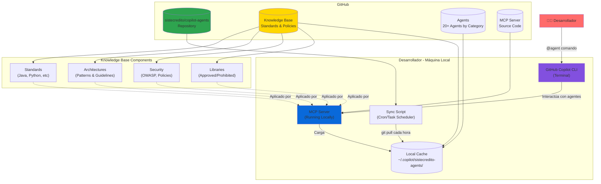
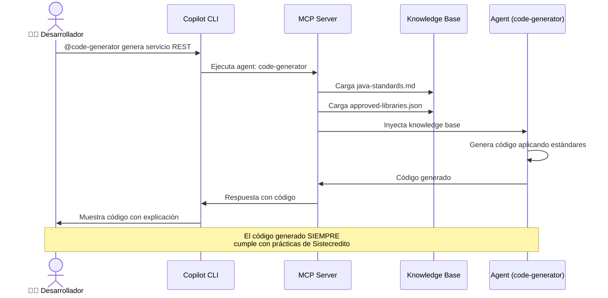
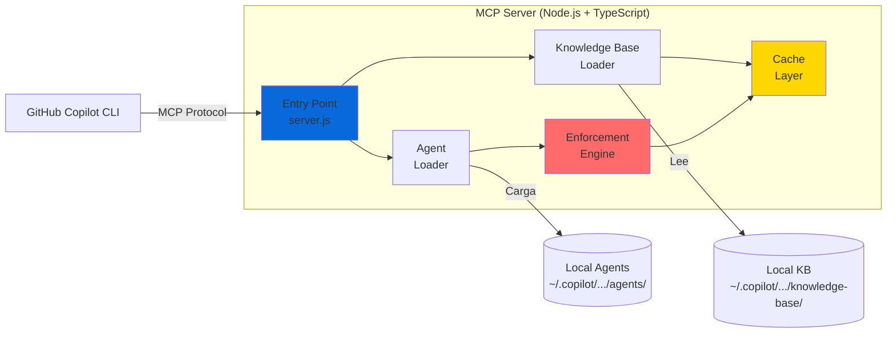
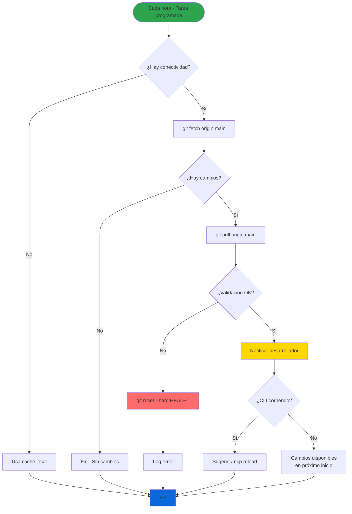
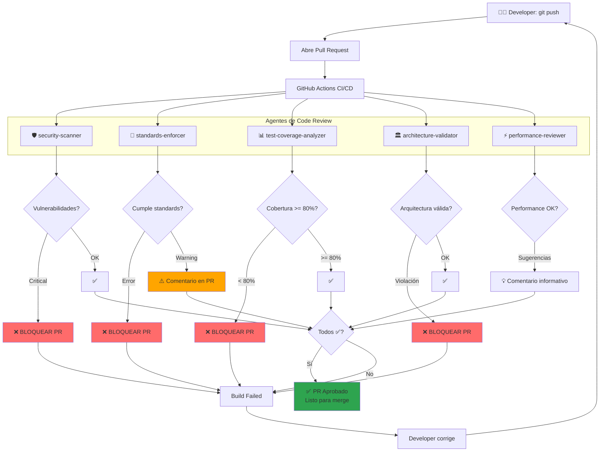
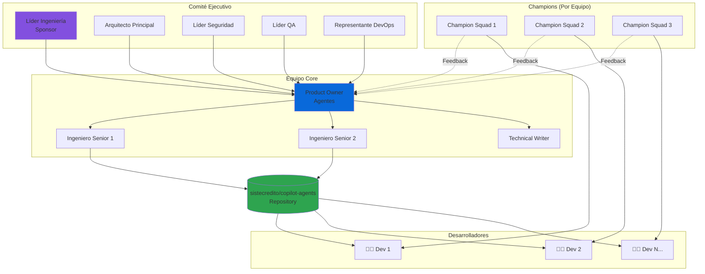
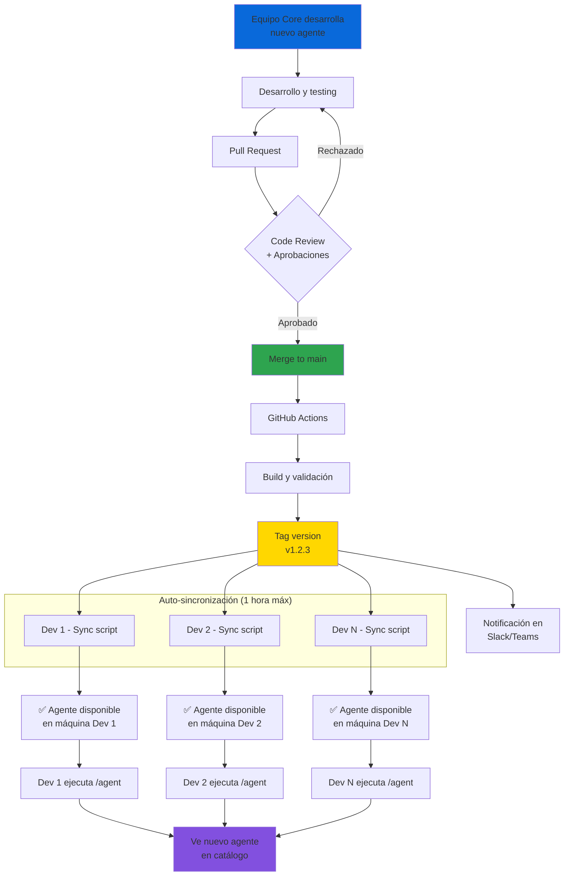
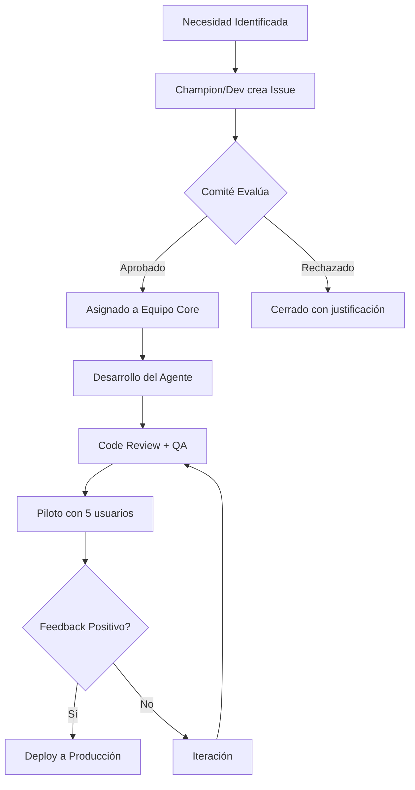

# Plan: Sistema de Agentes SDLC Empresarial para Sistecredito

## Contexto Empresarial
**Organización**: Sistecredito  
**Área responsable**: Ingeniería  
**Alcance**: Todos los desarrolladores de la compañía  
**Objetivo**: Automatizar completamente el SDLC usando agentes personalizados de GitHub Copilot CLI

## Problema
Sistecredito necesita un sistema centralizado para:
- Desarrollar agentes personalizados que automaticen cada fase del SDLC
- Distribuir e instalar agentes en todas las máquinas de desarrolladores
- Sincronizar actualizaciones automáticamente desde un repositorio central
- Mantener gobernanza y control de versiones de los agentes
- Asegurar consistencia en prácticas de desarrollo

## Diagramas de Arquitectura

### Arquitectura General del Sistema



### Flujo de Trabajo del Desarrollador



### Arquitectura del MCP Server



### Flujo de Sincronización Automática



### Proceso de Code Review con Agentes



### Estructura de Governance



### Deployment de Agentes a Todos los Desarrolladores



---

## Enfoque Propuesto

### Principio Fundamental
**Los agentes son los guardianes digitales de las prácticas tecnológicas de Sistecredito**. Cada agente tiene consignado el conocimiento específico de políticas, estándares, patrones arquitectónicos, y mejores prácticas de la organización, aplicándolas automáticamente en cada interacción con los desarrolladores.

### Arquitectura Empresarial
Sistema centralizado usando **MCP (Model Context Protocol)** con los siguientes componentes:

1. **Repositorio Central de Agentes** (GitHub Enterprise/GitHub.com)
   - Propiedad del área de Ingeniería
   - Control de versiones y releases
   - CI/CD para validación de agentes
   
2. **Agentes SDLC** categorizados por fase:
   - Development: code generation, refactoring, debugging
   - Testing: unit tests, integration tests, test automation
   - Code Review: standards enforcement, security scanning
   - Documentation: API docs, README generation
   - Deployment: scripts, configurations, pipelines
   
3. **Servidor MCP Empresarial**
   - Gestiona agentes localmente en cada máquina
   - Autenticación con GitHub Enterprise
   - Logging centralizado (opcional)
   
4. **Sistema de Despliegue Automatizado**
   - Script de instalación inicial para nuevos desarrolladores
   - Sincronización automática vía tarea programada
   - Notificaciones de actualizaciones
   
6. **Portal de Gobernanza** (opcional fase 2)
   - Métricas de uso de agentes
   - Versionado y rollback
   - Aprobación de cambios

### Componentes del Sistema

#### 1. Knowledge Base de Prácticas Tecnológicas
Repositorio separado o módulo dentro del repositorio de agentes que contiene:
- **Estándares de código** por lenguaje/framework
- **Arquitecturas aprobadas** (microservicios, event-driven, etc.)
- **Patrones de diseño** obligatorios y prohibidos
- **Políticas de seguridad** (OWASP, encriptación, autenticación)
- **Convenciones de naming** (variables, clases, APIs, bases de datos)
- **Templates aprobados** (proyectos, configuraciones, pipelines)
- **Catálogo de librerías** permitidas/prohibidas
- **Políticas de testing** (cobertura mínima, tipos de tests)
- **Estándares de documentación**

#### 2. Estructura del Repositorio Central (sistecredito/copilot-agents)
```
sistecredito-copilot-agents/
├── knowledge-base/                          # Base de conocimiento de Sistecredito
│   ├── standards/
│   │   ├── java-standards.md
│   │   ├── python-standards.md
│   │   ├── javascript-standards.md
│   │   ├── sql-standards.md
│   │   └── api-design-standards.md
│   ├── architecture/
│   │   ├── microservices-guidelines.md
│   │   ├── event-driven-patterns.md
│   │   ├── database-patterns.md
│   │   └── approved-architectures.json
│   ├── security/
│   │   ├── owasp-compliance.md
│   │   ├── authentication-patterns.md
│   │   ├── encryption-standards.md
│   │   └── vulnerability-checklist.json
│   ├── libraries/
│   │   ├── approved-libraries.json        # Librerías permitidas
│   │   ├── deprecated-libraries.json      # Librerías prohibidas
│   │   └── library-alternatives.md
│   ├── testing/
│   │   ├── unit-test-requirements.md
│   │   ├── integration-test-guidelines.md
│   │   ├── coverage-requirements.json     # 80% mínimo, etc.
│   │   └── test-templates/
│   ├── deployment/
│   │   ├── pipeline-templates/
│   │   ├── environment-configs/
│   │   └── deployment-checklist.md
│   └── documentation/
│       ├── readme-template.md
│       ├── api-doc-template.md
│       └── changelog-format.md
├── agents/
│   ├── development/
│   │   ├── code-generator/
│   │   │   ├── config.json               # Referencia a knowledge-base
│   │   │   ├── instructions.md           # "Usa Java Standards de Sistecredito"
│   │   │   ├── prompts/
│   │   │   └── examples/
│   │   ├── refactoring-expert/
│   │   ├── debugging-assistant/
│   │   └── architecture-advisor/
│   ├── testing/
│   │   ├── unit-test-generator/
│   │   ├── integration-tester/
│   │   ├── test-coverage-analyzer/
│   │   └── qa-automation-helper/
│   ├── code-review/
│   │   ├── security-scanner/             # Aplica OWASP de Sistecredito
│   │   ├── standards-enforcer/           # Valida coding standards
│   │   ├── performance-reviewer/
│   │   └── architecture-validator/       # Valida vs arquitecturas aprobadas
│   ├── documentation/
│   │   ├── api-doc-generator/
│   │   ├── readme-writer/
│   │   ├── changelog-maintainer/
│   │   └── diagram-generator/
│   └── deployment/
│       ├── pipeline-generator/
│       ├── config-manager/
│       ├── docker-expert/
│       └── k8s-helper/
├── mcp-server/
│   ├── package.json
│   ├── server.js
│   ├── agent-loader.js
│   └── knowledge-base-loader.js          # Carga knowledge-base en memoria
├── scripts/
│   ├── install.sh (Linux/macOS)
│   ├── install.ps1 (Windows)
│   ├── sync.sh
│   └── sync.ps1
├── governance/
│   ├── governance-model.md               # Comité, roles, procesos
│   ├── approval-process.md
│   ├── change-request-template.md
│   └── usage-policies.md
├── manifest.json (catálogo de todos los agentes)
├── CHANGELOG.md
└── README.md
```

#### 2. Servidor MCP Local
Un servidor MCP que:
- Lee las configuraciones de agentes desde el directorio local sincronizado
- Expone los agentes como herramientas disponibles en Copilot CLI
- Se configura usando el comando `/mcp add`

#### 3. Script de Sincronización
Un script que:
- Clona/actualiza el repositorio de agentes periódicamente
- Detecta cambios usando Git
- Notifica al usuario sobre actualizaciones
- Puede ejecutarse como tarea programada (cron/Task Scheduler)

## Plan de Implementación

### Fase 0: Recopilación de Prácticas Tecnológicas (Semana 0-1)
- [ ] **CRÍTICO**: Reunir con Arquitecto Principal y leads técnicos
- [ ] Recopilar documentación existente de estándares
- [ ] Inventariar librerías aprobadas/prohibidas actuales
- [ ] Documentar arquitecturas y patrones en uso
- [ ] Recopilar políticas de seguridad existentes
- [ ] Identificar prácticas no documentadas (conocimiento tribal)
- [ ] Crear primera versión del knowledge-base
- [ ] Validar y aprobar knowledge-base con Comité Ejecutivo

### Fase 1: Fundamentos y Diseño (Semana 1-2)
- [ ] Definir catálogo de agentes SDLC requeridos con stakeholders
- [ ] Priorizar agentes: identificar 5 críticos para piloto
- [ ] Investigar estructura técnica de MCP servers
- [ ] Definir schema de configuración (config.json) con campos empresariales
- [ ] Diseñar estructura del repositorio central con knowledge-base
- [ ] Establecer Comité de Gobernanza (miembros y roles)
- [ ] Definir procesos de gobernanza (creación, actualización, deprecation)
- [ ] Documentar enforcement levels (bloqueante vs warning)
- [ ] Crear templates para desarrollo de agentes

### Fase 2: Repositorio Central y Knowledge Base (Semana 2-3)
- [ ] Crear repositorio `sistecredito/copilot-agents` (privado)
- [ ] Implementar estructura de carpetas completa:
  - [ ] /knowledge-base/ con subdirectorios
  - [ ] /agents/ por categoría SDLC
  - [ ] /governance/
  - [ ] /mcp-server/
  - [ ] /scripts/
- [ ] Poblar knowledge-base inicial:
  - [ ] java-standards.md, python-standards.md
  - [ ] approved-libraries.json
  - [ ] owasp-compliance.md
  - [ ] architecture-patterns.md
- [ ] Configurar branch protection (main requiere 2 aprobaciones)
- [ ] Crear manifest.json con versionado semántico
- [ ] Agregar CI/CD para validación (GitHub Actions):
  - [ ] Validar JSON schemas
  - [ ] Validar Markdown lint
  - [ ] Validar links en knowledge-base
- [ ] Crear README con arquitectura completa
- [ ] Documentar governance model en /governance/

### Fase 3: Agentes Piloto Críticos (Semana 3-5)
**Prioridad**: 5 agentes más críticos basados en impacto

- [ ] **Agent 1: standards-enforcer** (BLOQUEANTE)
  - [ ] Implementar validación de naming conventions
  - [ ] Validar estructura de proyectos
  - [ ] Detectar librerías prohibidas
  - [ ] Generar warnings/errors según severidad
  - [ ] Testing exhaustivo con 10+ proyectos reales
  
- [ ] **Agent 2: security-scanner** (BLOQUEANTE)
  - [ ] Implementar detección OWASP Top 10
  - [ ] Detectar secrets hardcoded
  - [ ] Validar uso correcto de encriptación
  - [ ] Integrar con SonarQube (opcional)
  - [ ] Testing con código vulnerable conocido
  
- [ ] **Agent 3: code-generator**
  - [ ] Implementar generación de código por lenguaje
  - [ ] Cargar standards dinámicamente
  - [ ] Aplicar templates de Sistecredito
  - [ ] Incluir logging/error handling automático
  - [ ] Testing con casos de uso reales
  
- [ ] **Agent 4: unit-test-generator**
  - [ ] Analizar código y generar tests
  - [ ] Aplicar AAA pattern
  - [ ] Generar mocks apropiados
  - [ ] Aplicar naming conventions
  - [ ] Testing: validar que tests generados pasen
  
- [ ] **Agent 5: architecture-validator** (BLOQUEANTE)
  - [ ] Detectar violaciones de capas
  - [ ] Validar patrones arquitectónicos
  - [ ] Verificar single responsibility
  - [ ] Testing con arquitecturas válidas e inválidas

- [ ] Crear examples/ para cada agente con casos de uso
- [ ] Documentar config.json y instructions.md de cada uno
- [ ] Validar que agentes cargan knowledge-base correctamente
- [ ] Code review interno de cada agente

### Fase 4: Servidor MCP Empresarial (Semana 5-6)
- [ ] Setup proyecto Node.js + TypeScript
- [ ] Implementar knowledge-base-loader:
  - [ ] Carga inicial del knowledge-base en memoria
  - [ ] Watch para cambios en archivos
  - [ ] Validación de schemas JSON
- [ ] Implementar agent-loader:
  - [ ] Carga dinámica de agentes por categoría
  - [ ] Inyección de knowledge-base en contexto de agentes
  - [ ] Manejo de versiones de agentes
- [ ] Implementar autenticación:
  - [ ] Soporte para GitHub PAT
  - [ ] Verificación de permisos al repositorio
- [ ] Implementar enforcement engine:
  - [ ] Validación de código contra knowledge-base
  - [ ] Generación de warnings/errors
  - [ ] Decisión de bloqueo (enforcement levels)
- [ ] Agregar logging estructurado
- [ ] Implementar caché local para performance
- [ ] Testing unitario e integración del servidor
- [ ] Documentar API del servidor

### Fase 5: Sistema de Despliegue (Semana 4-5)
- [ ] Crear script de instalación inicial multiplataforma
  - [ ] install.sh (Linux/macOS con Homebrew)
  - [ ] install.ps1 (Windows con WinGet/Chocolatey)
- [ ] Implementar script de sincronización automática
  - [ ] sync.sh (cron job)
  - [ ] sync.ps1 (Task Scheduler)
- [ ] Configurar autenticación automática con GitHub
- [ ] Agregar verificación de integridad de instalación
- [ ] Crear desinstalador para limpieza completa

### Fase 6: Piloto con Equipo Reducido (Semana 5-6)
- [ ] Seleccionar 5-10 desarrolladores para piloto
- [ ] Desplegar sistema en máquinas piloto
- [ ] Capacitar usuarios piloto
- [ ] Recolectar feedback y métricas de uso
- [ ] Iterar sobre problemas encontrados
- [ ] Refinar documentación basada en feedback

### Fase 7: Despliegue Masivo (Semana 7-8)
- [ ] Preparar documentación de rollout
- [ ] Crear videos/tutoriales de instalación
- [ ] Coordinar con IT para despliegue asistido (opcional)
- [ ] Ejecutar instalación en todas las máquinas
- [ ] Soporte técnico durante rollout
- [ ] Validar instalaciones exitosas

### Fase 8: Operación y Mantenimiento (Continuo)
- [ ] Establecer proceso de actualización de agentes
- [ ] Monitorear uso y adopción
- [ ] Crear nuevos agentes según necesidades
- [ ] Mantener documentación actualizada
- [ ] Recolectar métricas de productividad
- [ ] Plan de mejora continua

## Consideraciones Técnicas

### Stack Tecnológico Recomendado
- **Servidor MCP**: Node.js (TypeScript) - mejor integración con ecosistema JS
- **Scripts de despliegue**: Bash + PowerShell + Python (para instalador unificado)
- **Formato de configuración**: JSON (config) + Markdown (instructions)
- **Sincronización**: Git + GitHub API
- **CI/CD**: GitHub Actions para validación automática
- **Autenticación**: GitHub PAT o GitHub App

## Modelo de Gobierno

### Comité de Gobernanza de Agentes

#### Estructura Organizacional

**1. Comité Ejecutivo (Steering Committee)**
- **Líder de Ingeniería**: Sponsor y decisión final
- **Arquitecto Principal**: Valida alineación arquitectónica
- **Líder de Seguridad**: Aprueba políticas de seguridad
- **Líder de QA**: Define estándares de calidad
- **Representante de DevOps**: Valida pipelines y deployment

**2. Equipo Core de Agentes**
- **Product Owner de Agentes**: Prioriza desarrollo de agentes
- **2-3 Ingenieros Senior**: Desarrollan y mantienen agentes
- **Technical Writer**: Documenta agentes y prácticas

**3. Champions de Agentes (por equipo/squad)**
- 1 desarrollador por equipo como enlace
- Recolectan feedback de sus equipos
- Proponen nuevos agentes o mejoras
- Capacitan a sus pares

### Procesos de Gobernanza

#### 1. Proceso de Creación de Nuevos Agentes



**Criterios de Aprobación:**
- ✅ Resuelve problema recurrente del SDLC
- ✅ No duplica funcionalidad existente
- ✅ Alineado con prácticas tecnológicas
- ✅ ROI estimado positivo (ahorro de tiempo)
- ✅ Factible técnicamente

#### 2. Proceso de Actualización de Agentes

**Cambios Menores (patch):**
- Bug fixes, mejoras de performance
- Aprobación: 1 ingeniero senior + code review
- Testing: Unitario + smoke test
- Despliegue: Automático con CI/CD

**Cambios Medios (minor):**
- Nuevas features, mejoras significativas
- Aprobación: Arquitecto Principal + QA Lead
- Testing: Completo + piloto con 10 usuarios
- Despliegue: Gradual (canary)

**Cambios Mayores (major):**
- Breaking changes, rediseño completo
- Aprobación: Comité Ejecutivo completo
- Testing: Exhaustivo + piloto extendido
- Despliegue: Planificado con comunicación previa

#### 3. Proceso de Actualización del Knowledge-Base

**Crítico**: El knowledge-base es la fuente de verdad de Sistecredito.

**Workflow:**
1. **Propuesta**: Issue con justificación y ejemplo
2. **Revisión Técnica**: Arquitecto valida alineación
3. **Revisión de Seguridad**: Security Lead aprueba si aplica
4. **PR con Aprobaciones**: 2 aprobaciones mínimo
5. **Testing**: Validar que agentes apliquen el cambio
6. **Comunicación**: Anuncio en Slack/Teams
7. **Deploy**: Sincronización automática a todas las máquinas

**Ejemplo de Cambio:**
```
Issue: "Agregar nueva librería aprobada: Apache Kafka"
- Arquitecto: Aprueba (alineado con event-driven)
- Seguridad: Aprueba (versión sin vulnerabilidades)
- Update: approved-libraries.json
- Testing: code-generator agent la sugiere correctamente
- Deploy: Sincroniza en 1 hora
```

#### 4. Proceso de Retiro de Agentes (Deprecation)

1. **Marcado como Deprecated** (1 mes aviso)
2. **Comunicación** a todos los desarrolladores
3. **Alternativa Sugerida** si existe
4. **Deshabilitación** después del período de aviso
5. **Eliminación** del repositorio (mantener en archive)

### Roles y Responsabilidades

| Rol | Responsabilidades | Tiempo Dedicado |
|-----|-------------------|-----------------|
| **Product Owner Agentes** | Priorizar roadmap, recolectar feedback, métricas | 50% |
| **Ingeniero Core** | Desarrollar agentes, mantener servidor MCP, code review | 80% |
| **Arquitecto Principal** | Aprobar diseño, validar alineación arquitectónica | 10% |
| **Security Lead** | Revisar políticas seguridad, aprobar cambios críticos | 10% |
| **QA Lead** | Definir estándares testing, validar calidad agentes | 15% |
| **Champions** | Feedback, capacitación, evangelización | 5% |

### Políticas de Uso

#### Obligatorio:
- ✅ Usar agentes para code generation en nuevos proyectos
- ✅ Ejecutar security-scanner antes de PR
- ✅ Generar tests con unit-test-generator
- ✅ Validar arquitectura con architecture-validator

#### Recomendado:
- 💡 Consultar debugging-assistant para troubleshooting
- 💡 Usar api-doc-generator para documentación
- 💡 Pipeline-generator para nuevos pipelines

#### Prohibido:
- ❌ Deshabilitar validaciones de seguridad
- ❌ Ignorar warnings de standards-enforcer sin justificación
- ❌ Modificar knowledge-base localmente (siempre vía PR)

### Métricas de Gobernanza

**Seguimiento Mensual:**
- Número de agentes activos
- Tasa de adopción por equipo
- Tiempo promedio de desarrollo con/sin agentes
- Issues de calidad detectados por agentes
- Violaciones de políticas detectadas
- Satisfacción de desarrolladores (NPS)

**KPIs Críticos:**
- **Cobertura de Standards**: >95% del código cumple estándares
- **Reducción de Vulnerabilidades**: -50% en 6 meses
- **Tiempo de Code Review**: -30%
- **Adopción**: >80% devs usan agentes semanalmente

---

## Catálogo Completo de Agentes Requeridos

### Agentes SDLC Propuestos

#### Categoría: Development
1. **code-generator** ⭐ CRÍTICO
   - **Propósito**: Genera código siguiendo EXACTAMENTE estándares de Sistecredito
   - **Knowledge Base**: java-standards.md, python-standards.md, approved-libraries.json
   - **Operación**: 
     - Valida lenguaje del proyecto
     - Carga estándares específicos del lenguaje
     - Genera código con naming conventions correctas
     - Incluye imports de librerías aprobadas
     - Agrega logging/error handling estándar
   - **Ejemplo**: "Genera un servicio REST para consultar clientes"
     - ✅ Usa Spring Boot (aprobado)
     - ✅ Sigue naming: `ClienteService`, `ClienteController`
     - ✅ Incluye manejo de errores corporativo
     - ✅ Logs con framework aprobado

2. **refactoring-expert**
   - **Propósito**: Refactoriza código legacy a estándares actuales
   - **Knowledge Base**: Todos los standards, architecture patterns
   - **Operación**: Identifica code smells, sugiere mejoras alineadas con Sistecredito

3. **debugging-assistant**
   - **Propósito**: Análisis de bugs considerando arquitectura de Sistecredito
   - **Knowledge Base**: architecture guidelines, common-issues.md
   - **Operación**: Analiza stack traces, sugiere fixes conocidos en Sistecredito

4. **database-helper** ⭐ CRÍTICO
   - **Propósito**: Genera SQL siguiendo estándares de bases de datos
   - **Knowledge Base**: sql-standards.md, database-patterns.md
   - **Operación**:
     - Valida naming de tablas/columnas
     - Sugiere índices apropiados
     - Aplica políticas de seguridad (no hardcoded passwords)
     - Genera migrations con versionado correcto

5. **architecture-advisor** ⭐ CRÍTICO
   - **Propósito**: Guía decisiones arquitectónicas
   - **Knowledge Base**: approved-architectures.json, microservices-guidelines.md
   - **Operación**:
     - "¿Debo usar microservicio o monolito?" → responde según políticas
     - Valida que el diseño propuesto esté aprobado
     - Sugiere patrones específicos de Sistecredito

#### Categoría: Testing
1. **unit-test-generator** ⭐ CRÍTICO
   - **Propósito**: Genera tests unitarios siguiendo estándares de Sistecredito
   - **Knowledge Base**: unit-test-requirements.md, test-templates/
   - **Operación**:
     - Genera tests con framework aprobado (JUnit, pytest, Jest)
     - Sigue estructura de tests de Sistecredito (AAA: Arrange-Act-Assert)
     - Incluye mocks apropiados
     - Aplica naming conventions: `test_<metodo>_<escenario>_<resultado>`
   - **Ejemplo**: Para método `calcularInteres()`
     - ✅ `test_calcularInteres_montoPositivo_retornaInteresCalculado()`
     - ✅ `test_calcularInteres_montoNegativo_lanzaExcepcion()`

2. **integration-tester**
   - **Propósito**: Diseña tests de integración end-to-end
   - **Knowledge Base**: integration-test-guidelines.md
   - **Operación**: Genera tests que validan flujos completos

3. **test-coverage-analyzer** ⭐ CRÍTICO
   - **Propósito**: Valida que la cobertura cumple requisitos (80% mínimo)
   - **Knowledge Base**: coverage-requirements.json
   - **Operación**:
     - Analiza reporte de cobertura
     - Identifica métodos sin tests
     - Sugiere tests faltantes priorizados
     - **BLOQUEA** PR si cobertura < 80%

4. **e2e-test-designer**
   - **Propósito**: Genera tests E2E con frameworks aprobados
   - **Knowledge Base**: e2e-frameworks.json (Selenium, Playwright)
   - **Operación**: Crea scenarios de testing basados en user stories

5. **qa-automation-helper**
   - **Propósito**: Asiste QA en automatización de casos de prueba
   - **Knowledge Base**: qa-best-practices.md
   - **Operación**: Convierte casos manuales a scripts automatizados

#### Categoría: Code Review (Agentes Guardianes)
1. **security-scanner** ⭐⭐ MUY CRÍTICO
   - **Propósito**: Detecta vulnerabilidades aplicando políticas de seguridad de Sistecredito
   - **Knowledge Base**: owasp-compliance.md, security-checklist.json, vulnerability-db/
   - **Operación**:
     - Escanea código en búsqueda de OWASP Top 10
     - Detecta secrets hardcoded (API keys, passwords)
     - Valida uso de encriptación en datos sensibles
     - Verifica autenticación/autorización correcta
     - **BLOQUEA** PR si encuentra vulnerabilidades CRITICAL
   - **Ejemplo de Bloqueo**:
     - ❌ Password en código: `String pass = "admin123";`
     - ❌ SQL Injection: `query = "SELECT * FROM users WHERE id=" + userId`
     - ❌ XSS: No sanitiza input del usuario

2. **standards-enforcer** ⭐⭐ MUY CRÍTICO
   - **Propósito**: Valida que el código cumple 100% con standards de Sistecredito
   - **Knowledge Base**: Todos los *-standards.md
   - **Operación**:
     - Valida naming conventions
     - Verifica estructura de carpetas
     - Detecta uso de librerías prohibidas
     - Valida documentación de métodos/clases
     - Genera **WARNINGS** o **ERRORS** según severidad
   - **Ejemplo**:
     - ❌ ERROR: Usa librería prohibida `log4j 1.x` → debe usar `logback`
     - ⚠️ WARNING: Método sin documentación JSDoc
     - ⚠️ WARNING: Nombre de variable no sigue camelCase

3. **performance-reviewer**
   - **Propósito**: Identifica cuellos de botella y anti-patterns de performance
   - **Knowledge Base**: performance-patterns.md
   - **Operación**:
     - Detecta N+1 queries
     - Identifica loops anidados ineficientes
     - Sugiere caching donde aplique
     - Valida uso eficiente de conexiones BD

4. **architecture-validator** ⭐ CRÍTICO
   - **Propósito**: Valida que el diseño cumple arquitecturas aprobadas
   - **Knowledge Base**: approved-architectures.json, microservices-guidelines.md
   - **Operación**:
     - Detecta violaciones de capas (ej: Controller llamando directamente a BD)
     - Valida que microservicios cumplan principios (single responsibility)
     - Verifica que se usan patrones aprobados (Repository, Factory, etc.)
     - **BLOQUEA** PR si viola arquitectura crítica
   - **Ejemplo de Bloqueo**:
     - ❌ Controller accede directamente a BD (debe usar Service)
     - ❌ Microservicio con más de 3 responsabilidades

#### Categoría: Documentation
1. **api-doc-generator** ⭐ CRÍTICO
   - **Propósito**: Genera documentación de APIs siguiendo template de Sistecredito
   - **Knowledge Base**: api-doc-template.md, openapi-standards.json
   - **Operación**:
     - Analiza código y genera OpenAPI/Swagger
     - Aplica template corporativo
     - Incluye ejemplos de request/response
     - Documenta códigos de error estándar de Sistecredito
   - **Output**: Documentación lista para publicar en portal interno

2. **readme-writer**
   - **Propósito**: Genera/actualiza READMEs siguiendo estructura estándar
   - **Knowledge Base**: readme-template.md
   - **Operación**:
     - Genera secciones: Descripción, Instalación, Uso, Contribución
     - Incluye badges de CI/CD, cobertura
     - Aplica formato Markdown de Sistecredito

3. **changelog-maintainer**
   - **Propósito**: Mantiene CHANGELOG.md actualizado siguiendo Keep a Changelog
   - **Knowledge Base**: changelog-format.md
   - **Operación**:
     - Analiza commits y PRs
     - Categoriza cambios (Added, Changed, Fixed, Deprecated)
     - Genera entradas con links a PRs

4. **diagram-generator**
   - **Propósito**: Genera diagramas de arquitectura automáticamente
   - **Knowledge Base**: diagram-standards.md
   - **Operación**:
     - Analiza estructura de proyecto
     - Genera diagramas Mermaid/PlantUML
     - Documenta flujos y dependencias

#### Categoría: Deployment
1. **pipeline-generator** ⭐ CRÍTICO
   - **Propósito**: Genera pipelines CI/CD siguiendo templates de Sistecredito
   - **Knowledge Base**: pipeline-templates/, deployment-checklist.md
   - **Operación**:
     - Genera GitHub Actions / Jenkins pipelines
     - Incluye stages estándar: build, test, security-scan, deploy
     - Aplica políticas de deployment (staging → prod)
     - Incluye rollback automático
   - **Ejemplo**: Pipeline con:
     - ✅ Build con Maven/Gradle aprobado
     - ✅ Tests unitarios (cobertura 80%+)
     - ✅ SonarQube scan
     - ✅ Deployment a K8s con canary

2. **config-manager**
   - **Propósito**: Gestiona configuraciones por ambiente sin hardcoding
   - **Knowledge Base**: environment-configs/, secrets-management.md
   - **Operación**:
     - Genera archivos de config por env (dev, qa, prod)
     - Usa secrets manager (Azure Key Vault, etc.)
     - Valida que no hay secrets en código

3. **docker-expert**
   - **Propósito**: Genera Dockerfiles optimizados y seguros
   - **Knowledge Base**: docker-best-practices.md, approved-base-images.json
   - **Operación**:
     - Usa solo base images aprobadas
     - Aplica multi-stage builds
     - Minimiza layers y tamaño de imagen
     - Incluye health checks

4. **k8s-helper**
   - **Propósito**: Genera manifiestos Kubernetes siguiendo standards
   - **Knowledge Base**: k8s-templates/, helm-charts/
   - **Operación**:
     - Genera Deployments, Services, Ingress
     - Aplica resource limits (CPU/memoria)
     - Incluye probes (liveness, readiness)
     - Usa Helm charts aprobados

### Agentes Adicionales (Fase 2)

#### Categoría: Project Management
1. **jira-assistant**: Crea/actualiza tickets con información técnica
2. **story-estimator**: Estima complejidad de user stories
3. **sprint-planner**: Ayuda a planificar sprints basado en capacidad

#### Categoría: Observability
1. **logging-helper**: Genera logs estructurados siguiendo estándares
2. **metrics-generator**: Instrumenta código con métricas (Prometheus)
3. **alert-configurator**: Configura alertas en sistemas de monitoreo

---

## Cómo Operan los Agentes en el SDLC

### Workflow Típico del Desarrollador

```
1. INICIO DE TAREA
   Developer: "@code-generator genera servicio REST para calcular préstamos"
   Agent: 
     ✓ Carga java-standards.md
     ✓ Carga approved-libraries.json
     ✓ Genera código con Spring Boot
     ✓ Aplica naming: PrestamoService, PrestamoController
     ✓ Incluye validaciones corporativas
     ✓ Agrega logging estándar

2. ESCRIBIR TESTS
   Developer: "@unit-test-generator crea tests para PrestamoService"
   Agent:
     ✓ Carga test-templates/
     ✓ Genera tests con JUnit 5
     ✓ Aplica AAA pattern
     ✓ 100% cobertura de métodos públicos
     ✓ Naming: test_calcularPrestamo_montoValido_retornaResultado()

3. CODE REVIEW AUTOMÁTICO
   Developer: Hace commit y abre PR
   Agents (ejecutados automáticamente en CI/CD):
     → @security-scanner:
       ✓ No vulnerabilidades detectadas
     → @standards-enforcer:
       ⚠️ WARNING: 2 métodos sin JavaDoc
       ✓ Resto cumple estándares
     → @test-coverage-analyzer:
       ✓ Cobertura: 85% (pasa el 80% mínimo)
     → @architecture-validator:
       ✓ Arquitectura válida (3 capas: Controller-Service-Repository)

4. CORRECCIONES
   Developer: "@refactoring-expert agrega JavaDoc faltante"
   Agent:
     ✓ Genera JavaDoc siguiendo template
     ✓ Incluye @param, @return, @throws

5. DOCUMENTACIÓN
   Developer: "@api-doc-generator documenta endpoints"
   Agent:
     ✓ Genera OpenAPI 3.0
     ✓ Aplica template de Sistecredito
     ✓ Incluye ejemplos de request/response

6. DEPLOYMENT
   Developer: "@pipeline-generator crea pipeline para este servicio"
   Agent:
     ✓ Genera GitHub Actions workflow
     ✓ Incluye stages: build, test, sonar, deploy
     ✓ Deployment a K8s con canary
     ✓ Rollback automático si falla
```

### Integración con Git Workflow

```
feature/JIRA-123-prestamos
├── Developer commits código
├── Pre-commit hook ejecuta:
│   ├── @standards-enforcer (local, rápido)
│   └── @security-scanner (scan básico)
├── Developer push a GitHub
├── PR abre automáticamente
├── GitHub Actions ejecuta:
│   ├── Build
│   ├── Tests
│   ├── @security-scanner (completo)
│   ├── @standards-enforcer (completo)
│   ├── @test-coverage-analyzer
│   ├── @architecture-validator
│   └── @performance-reviewer
├── Agentes comentan en PR:
│   ├── ✅ Security: PASS
│   ├── ⚠️ Standards: 2 warnings
│   ├── ✅ Coverage: 85%
│   ├── ✅ Architecture: PASS
│   └── 💡 Performance: 3 sugerencias
├── Developer corrige warnings
├── Re-push → Re-validación
├── Aprobación manual (code review humano)
└── Merge → Deploy automático
```

### Enforcement Levels

**BLOQUEANTE (no permite merge):**
- ❌ Vulnerabilidad CRITICAL/HIGH
- ❌ Cobertura < 80%
- ❌ Violación de arquitectura crítica
- ❌ Uso de librería prohibida

**WARNING (permite merge con justificación):**
- ⚠️ Falta de documentación
- ⚠️ Performance issues no críticos
- ⚠️ Complejidad ciclomática alta

**SUGERENCIA (informativo):**
- 💡 Mejoras de código
- 💡 Refactorings opcionales
- 💡 Optimizaciones

---

## Ejemplos de Prácticas Tecnológicas Consignadas

### Ejemplo 1: Java Standards (java-standards.md)

```markdown
# Java Standards - Sistecredito

## Versión
- Java 17 LTS (mínimo)
- Spring Boot 3.x

## Naming Conventions
- Clases: PascalCase (ej: ClienteService)
- Métodos: camelCase (ej: calcularInteres)
- Constantes: UPPER_SNAKE_CASE (ej: MAX_INTENTOS)
- Packages: lowercase (ej: com.sistecredito.prestamos)

## Librerías Obligatorias
- Logging: SLF4J + Logback
- Validación: Jakarta Bean Validation
- HTTP Client: Spring WebClient
- Testing: JUnit 5 + Mockito

## Prohibido
- ❌ System.out.println() → Usar logger
- ❌ Date → Usar LocalDate/LocalDateTime
- ❌ Exceptions genéricas → Usar custom exceptions

## Estructura de Proyecto
```
src/
├── main/
│   ├── java/com/sistecredito/{modulo}/
│   │   ├── controller/
│   │   ├── service/
│   │   ├── repository/
│   │   ├── model/
│   │   ├── dto/
│   │   └── exception/
│   └── resources/
└── test/
```

## Manejo de Errores
SIEMPRE usar @RestControllerAdvice para manejo global:
```java
@RestControllerAdvice
public class GlobalExceptionHandler {
    @ExceptionHandler(RecursoNoEncontradoException.class)
    public ResponseEntity<ErrorResponse> handleNotFound(RecursoNoEncontradoException ex) {
        // código estándar
    }
}
```
```

### Ejemplo 2: Approved Libraries (approved-libraries.json)

```json
{
  "java": {
    "logging": [
      { "name": "SLF4J", "version": "2.x", "status": "approved" },
      { "name": "Logback", "version": "1.4.x", "status": "approved" },
      { "name": "Log4j 1.x", "status": "prohibited", "reason": "vulnerabilities", "alternative": "Logback" }
    ],
    "testing": [
      { "name": "JUnit 5", "version": "5.9+", "status": "approved" },
      { "name": "Mockito", "version": "5.x", "status": "approved" },
      { "name": "TestNG", "status": "deprecated", "alternative": "JUnit 5" }
    ],
    "web": [
      { "name": "Spring Boot", "version": "3.2+", "status": "approved" },
      { "name": "Spring WebFlux", "version": "6.x", "status": "approved" }
    ]
  },
  "python": {
    "web": [
      { "name": "FastAPI", "version": "0.100+", "status": "approved" },
      { "name": "Flask", "version": "3.x", "status": "approved" }
    ]
  }
}
```

### Ejemplo 3: Security Policies (owasp-compliance.md)

```markdown
# OWASP Compliance - Sistecredito

## A01:2021 - Broken Access Control
- ✅ Validar permisos en TODAS las operaciones
- ✅ Usar @PreAuthorize en endpoints
- ❌ NUNCA confiar en input del cliente para permisos

## A02:2021 - Cryptographic Failures
- ✅ Encriptar datos sensibles en BD (AES-256)
- ✅ HTTPS obligatorio en producción
- ✅ Passwords con BCrypt (12 rounds mínimo)
- ❌ NO usar MD5/SHA1 para passwords

## A03:2021 - Injection
- ✅ Usar PreparedStatements SIEMPRE
- ✅ Validar/sanitizar todos los inputs
- ❌ NUNCA concatenar strings en SQL

## Secretos
- ❌ PROHIBIDO hardcodear passwords/keys
- ✅ Usar Azure Key Vault en producción
- ✅ Usar variables de entorno localmente
```

---

### Seguridad y Gobernanza
- **Control de acceso**: Solo empleados de Sistecredito con GitHub organizacional
- **Auditoría**: Logs de cambios en agentes
- **Versionado**: Semantic versioning (major.minor.patch)
- **Testing obligatorio**: PRs requieren validación antes de merge
- **Rollback**: Capacidad de revertir a versiones anteriores

### Requerimientos de Infraestructura
- **Repositorio GitHub**: Enterprise o privado en GitHub.com
- **Permisos**: Desarrolladores con read-only, Ingeniería con write
- **GitHub PATs**: Generación centralizada o GitHub App
- **Ancho de banda**: Sincronización periódica (~1-5 MB por sync)
- **Almacenamiento local**: ~50-100 MB por instalación

### Limitaciones y Mitigaciones
| Limitación | Impacto | Mitigación |
|-----------|---------|------------|
| Sincronización no en tiempo real | Cambios tardan hasta 1 hora | Reducir frecuencia de sync a 15 min |
| Requiere reinicio de CLI | Agentes actualizados no disponibles inmediatamente | Notificar usuario y ofrecer comando de recarga |
| Dependencia de conectividad | Sin internet = sin actualizaciones | Caché local con última versión válida |
| Curva de aprendizaje | Adopción lenta | Capacitación y documentación extensa |

## Entregables Finales

### Para Desarrolladores
1. ✅ Instalación one-click con script automatizado
2. ✅ Catálogo de 15-20 agentes SDLC funcionales
3. ✅ Sincronización automática transparente
4. ✅ Documentación de uso por agente
5. ✅ Soporte técnico y troubleshooting

### Para Ingeniería
1. ✅ Repositorio central con CI/CD configurado
2. ✅ Templates para crear nuevos agentes
3. ✅ Proceso de revisión y aprobación de cambios
4. ✅ Métricas de uso y adopción (opcional)
5. ✅ Documentación de arquitectura y mantenimiento

### Documentación
1. **README.md**: Arquitectura general del sistema
2. **INSTALLATION.md**: Guía de instalación paso a paso
3. **AGENT_DEVELOPMENT.md**: Cómo crear nuevos agentes
4. **GOVERNANCE.md**: Políticas y proceso de aprobación
5. **TROUBLESHOOTING.md**: Problemas comunes y soluciones
6. **USAGE_GUIDE.md**: Cómo usar cada agente efectivamente

## Métricas de Éxito
- ✅ 100% de desarrolladores con sistema instalado
- ✅ Tiempo de instalación < 5 minutos
- ✅ Sincronización exitosa cada hora
- ✅ Adopción: >70% de desarrolladores usan agentes semanalmente
- ✅ Satisfacción: NPS > 8/10
- ✅ Productividad: Reducción 20-30% tiempo en tareas automatizables

## Riesgos y Planes de Contingencia

| Riesgo | Probabilidad | Impacto | Mitigación |
|--------|--------------|---------|------------|
| Resistencia al cambio | Alta | Medio | Capacitación, champions internos, demostrar valor |
| Problemas de conectividad | Media | Bajo | Caché local, modo offline |
| Incompatibilidad de plataformas | Baja | Alto | Testing exhaustivo en 3 SO |
| GitHub Enterprise no disponible | Baja | Medio | Usar GitHub.com privado |
| Sobrecarga del servidor MCP | Media | Medio | Optimización, caché agresivo |

## Costos Estimados

### Tiempo de Desarrollo
- **Fase 1-2**: 1-2 semanas (Ingeniería - 1 dev)
- **Fase 3-4**: 2-3 semanas (Ingeniería - 2 devs)
- **Fase 5-7**: 3-4 semanas (Ingeniería + IT)
- **Total**: 6-9 semanas (1.5-2 meses)

### Recursos
- Desarrolladores: 1-2 FTE durante 2 meses
- IT para despliegue: 0.5 FTE durante 1 mes
- Soporte continuo: 0.25 FTE

### Infraestructura
- Repositorio GitHub: Incluido en GitHub Enterprise
- Almacenamiento: Mínimo (~100 MB total)
- **Costo adicional**: Prácticamente $0

## Próximos Pasos Inmediatos

### Decisiones Requeridas URGENTES

#### 1. Infraestructura
- [ ] ¿GitHub Enterprise de Sistecredito o GitHub.com privado?
- [ ] ¿Naming del repositorio: `sistecredito/copilot-agents` o diferente?

#### 2. Knowledge Base
- [ ] ¿Ya existe documentación de estándares o hay que crearla desde cero?
- [ ] ¿Quién es responsable de mantener el knowledge-base actualizado?
- [ ] ¿Cada cuánto revisar/actualizar prácticas tecnológicas?

#### 3. Agentes Piloto
**Propuesta de 5 agentes críticos (orden de prioridad):**
1. ⭐⭐ **security-scanner** (máximo impacto en calidad)
2. ⭐⭐ **standards-enforcer** (consistencia de código)
3. ⭐ **code-generator** (productividad)
4. ⭐ **unit-test-generator** (cobertura de tests)
5. ⭐ **architecture-validator** (arquitectura correcta)

**¿Están de acuerdo o priorizarían otros?**

#### 4. Governance
- [ ] ¿Quiénes serán miembros del Comité Ejecutivo?
  - Líder de Ingeniería: ______
  - Arquitecto Principal: ______
  - Líder de Seguridad: ______
  - Líder de QA: ______
  - Representante DevOps: ______
- [ ] ¿Quiénes serán el equipo Core de Agentes? (2-3 ingenieros)

#### 5. Piloto
- [ ] ¿Qué equipos/squads participarán en piloto? (5-10 devs)
- [ ] ¿Proyecto específico para piloto o uso general?
- [ ] ¿Duración del piloto? (Recomendado: 4 semanas)

#### 6. Enforcement
- [ ] ¿Nivel de enforcement inicial?
  - **Opción A**: Solo warnings (no bloquea PRs) → adopción gradual
  - **Opción B**: Bloqueante desde día 1 → adopción forzada
  - **Opción C** ✅ Recomendado: Warnings primeras 4 semanas, luego bloqueante

#### 7. Telemetría
- [ ] ¿Recolectar métricas de uso de agentes?
  - Si sí: ¿Qué herramienta? (Google Analytics, Mixpanel, custom)
  - Si no: ¿Cómo medir adopción y éxito?

#### 8. Timeline
- [ ] ¿Timeline esperado? 
  - **Agresivo**: 6 semanas (riesgo alto)
  - **Balanceado** ✅: 8-10 semanas (recomendado)
  - **Conservador**: 12+ semanas (riesgo bajo)

### Acción Inmediata
**Opción A**: Comenzar con Fase 1 (investigación técnica de MCP)  
**Opción B**: Crear repositorio y estructura base primero  
**Opción C**: Desarrollar un agente prototipo end-to-end para validar concepto

---

**Recomendación**: Comenzar con **Opción C** - crear un agente prototipo completo (ej: "unit-test-generator") para validar toda la arquitectura antes de escalar.
